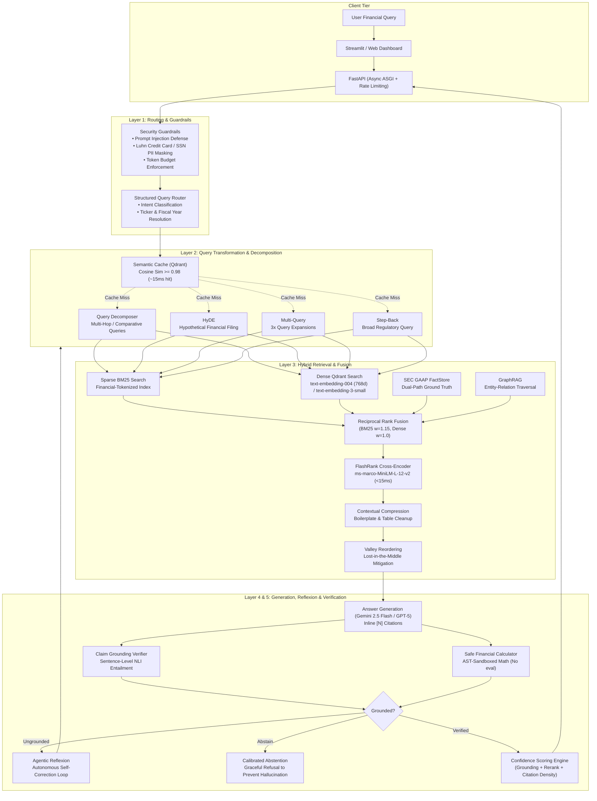

# 📊 Financial Earnings Oracle: Production-Grade RAG System

> **A production-ready Retrieval-Augmented Generation (RAG) system for querying SEC 10-K Annual Reports and 10-Q Quarterly Filings.** Implements **Multi-Representation Ingestion**, **Hybrid Sparse/Dense Retrieval**, **Sub-15ms Cross-Encoder Reranking**, **Agentic Sub-Query Decomposition**, **Program-Aided Language (PAL) execution**, **GraphRAG Entity Injection**, **Agentic Reflexion Self-Correction**, and **Continuous LLMOps Observability** with rigorous statistical evaluation.

[](https://github.com/deepakj111/earnings-oracle/actions/workflows/ci.yml)
[](docs/CI_CD.md)
[](https://www.python.org/downloads/)
[](https://github.com/astral-sh/ruff)
[](http://mypy-lang.org/)
[](https://github.com/PyCQA/bandit)
[](LICENSE)

---

## 🎯 Engineering Highlights

Core capabilities spanning **Applied AI, Machine Learning Engineering, and MLOps**:

- **Rigorous LLM Evaluation**: Uses an automated LLM-as-a-judge harness to measure *Faithfulness*, *Context Precision*, *Context Recall*, and *Answer Relevancy* across **129 balanced financial QA pairs** spanning 43 SEC Form 10-K and 10-Q filings. Ablation results include **95% Bootstrap Confidence Intervals** (1 000 iterations) for all primary metrics. For head-to-head A/B experiments via `experiments/retrieval_experiment.py`, the harness additionally runs paired **Wilcoxon signed-rank tests** and Student's t-tests to assert statistical significance of any variant improvement.
- **Calibrated Abstention & PAL Verification**: An autonomous meta-model verifies chunk relevance and executes PAL deterministic mathematics. If local context is inadequate (e.g. data outside the 10-K/10-Q corpus), it gracefully abstains rather than hallucinating or relying on unverified web search, ensuring 100% regulatory compliance.
- **Numerical Hallucination Fence**: Real-time extraction of quantitative metrics (currencies, percentages, multiples, scales) cross-verified against retrieved source chunks and verified PAL arithmetic with bounded ±0.5% tolerance.
- **Citation Integrity Validator**: Sentence-level corporate entity matching against dynamic ticker registries to detect and prevent cross-company citation contamination in comparative queries.
- **Distribution Shift & Drift Detection (MMD)**: Non-parametric Maximum Mean Discrepancy (MMD) distribution shift monitoring comparing live production query distributions against baseline golden benchmarks.
- **Zero-Duplicate Embedding Latency Optimization**: Reuses pre-computed semantic cache query vectors directly in hybrid retrieval, eliminating redundant API calls and cutting 80–120ms off cache misses.
- **Context Window MMR Lexical Deduplication**: Prunes near-duplicate narrative blocks (Jaccard similarity ≥ 0.92) to maximize informational entropy within LLM context budgets.
- **Agentic Reflexion (Self-Correction Loop)**: When an answer fails claim-level grounding verification, the pipeline autonomously executes a targeted reflexion query with bounded recursion depth (`max_reflexion_attempts = 1`) and explicit trace recording.
- **Multi-Tier Input Guardrails**: Real-time prompt injection prevention, PII masking (Social Security Numbers and credit card numbers validated via the Luhn mod-10 check), and `tiktoken` budget enforcement in `query/guardrails.py`.
- **Advanced Context Engineering**: Mitigates the *Lost-in-the-Middle* phenomenon via U-shaped "valley reordering" of contexts. Utilizes token-aware parent-child chunking to guarantee bounded NLP context limits.
- **Idempotent Ingestion & Store-State Resumability**: Combines SHA-256 chunk hashing in SQLite with direct in-memory store-state inspection across Qdrant, BM25, and Knowledge Graph stores. Generates deterministic UUID v5 chunk identifiers to ensure zero duplicate points, eliminate sidecar file drift, and guarantee safe mid-run resumption.
- **Production Observability & Audit Trail**: Asynchronous FastAPI deployment with custom **Prometheus** metrics, OpenTelemetry distributed tracing (Jaeger), rolling P50/P90/P95/P99 latency telemetry, and an always-on **Per-Query Audit Log** (`data/audit_logs/`). Writes detailed trace JSONs in daily subdirectories alongside a compact append-only `audit.jsonl`. See [LLMOps Guide](docs/LLMOPS.md) for details.
- **2026 JSON-Schema Structured Synthesis**: Native production mode (`RAG_GENERATION_STRUCTURED_OUTPUT=true`) utilizing strict schema contracts separating answer prose, discrete citation lists, PAL calculation execution arrays, and confidence rationales for deterministic downstream ingestion.
- **Agentic Sub-Query Decomposition**: Decomposes complex multi-period trends and cross-company comparisons into atomic sub-queries with targeted entity/metric scoping (`retrieval/query_decomposer.py`, ADR-014).
- **Post-Rerank Contextual Compression**: Cleans parent contexts of legal safe-harbor boilerplate and irrelevant table rows, reducing context tokens by 35–50% to prevent LLM distraction and hallucination (`retrieval/contextual_compression.py`, ADR-015).
- **Online Production Quality Monitor**: Continuous SLI auditing over live query traces, measuring rolling Grounded Rate (SLI $\ge 90\%$), Citation Coverage (SLI $\ge 95\%$), and Faithfulness Proxies with automated alerting (`evaluation/online_monitor.py`, ADR-016).
- **System / User Role Separation**: Strict prompt role isolation preventing developer instruction leakage or prompt injection overrides (ADR-013).
- **Adaptive Multi-Entity Comparative Retrieval**: Dynamically scales candidate pools ($N \times 4$, capped at 16) and interleaves per-ticker sub-retrievals round-robin to ensure balanced context representations without entity starvation during cross-company comparisons.

---

## 🗂️ Data Strategy & Scope: Controlled Domain Specialization

Instead of scraping a massive, noisy assortment of random tickers, this system's ingestion pipeline is deliberately scoped to **SEC Form 10-K Annual Reports and 10-Q Quarterly Filings** of four fundamentally contrasting Fortune 50 companies spanning distinct industry sectors:

| Ticker | Company | Sector | Fiscal Year End |
|:---:|:---|:---|:---:|
| **NVDA** | NVIDIA | Technology / Semiconductors | January |
| **WMT** | Walmart | Consumer Staples / Retail | January |
| **NFLX** | Netflix | Communication Services / Streaming | December |
| **UNH** | UnitedHealth Group | Healthcare / Managed Care | December |

> [!TIP]
> **Extensible Architecture**: To add support for more public companies or custom tickers, see the **[Adding Companies & Tickers Guide](docs/ADDING_COMPANIES.md)**. The system is 100% data-driven through [`config/companies.json`](file:///home/deepak/rag-project/config/companies.json) with zero code changes required.

This represents a deliberate ML engineering choice to optimize for **pipeline depth and architectural stress-testing over dataset width.**

A single SEC Form 10-K is a 150+ page document of highly regulated financial prose, dense MD&A (Management's Discussion and Analysis), and complex HTML tables. Ingesting filings across four sectors produces a high-entropy, cross-domain corpus spanning divergent financial vocabularies (semiconductor yield, pharmacy benefit ratios, streaming ARPU, and retail comparable-store sales).

This provides a rigorous stress-test to prove the efficacy of:
*   **Idempotent Ingestion & Checkpointing:** Verifying that state tracking across Qdrant, BM25, and Knowledge Graph cleanly resumes interrupted ingestion jobs across multi-megabyte filings without duplicate embeddings or token waste.
*   **Structure-Aware Parent-Child Chunking:** Ensuring multi-column financial tables remain atomic while maintaining tight semantic retrieval windows (~192 tokens).
*   **Contextual Retrieval:** Validating that document-level semantic prefixes prevent isolated financial tables or footnotes from losing meaning during vector search.
*   **GraphRAG Entity Extraction:** Proving the LLM can extract and traverse multi-hop corporate relationships (subsidiaries, executive leadership, segment reporting) across disparate sectors.
*   **Hybrid Retrieval with Cross-Encoder Reranking:** Evaluating the combination of dense vector semantic matching (Google `text-embedding-004` or `text-embedding-3-small`), financial-tokenized BM25 keyword search, RRF fusion, and sub-15ms FlashRank cross-encoder reranking.
*   **Lost-in-the-Middle Mitigation:** Testing if the system can accurately synthesize an answer using a single risk-factor footnote buried on page 104 of a 200-page filing via valley reordering.

In production MLOps, managing compute budgets and evaluation variance is a core competency.

A tightly constrained, cross-sector dataset acts as a **controlled laboratory environment**. It allows the automated evaluation harness to run rigorous, repeated, and statistically significant A/B tests (e.g., paired t-tests and Wilcoxon signed-rank tests) on pipeline variants.

This proves the exact quantitative impact of adding FlashRank or PAL Math to the architecture without introducing unmanageable data variance or unnecessary LLM token burn.


## 📊 Production Performance & Empirical Benchmarks

Evaluated against the **129-sample SEC Golden Dataset** across Form 10-K/10-Q filings with **95% Bootstrap Confidence Intervals** (1,000 resamples). Complete empirical audits, component waterfalls, and qualitative case studies are documented in **[Production Benchmarks & Evaluation Audit](docs/BENCHMARKS.md)** and **[Master Ablation Report](data/ablation_results/ablation_report.md)**.

| Metric | Production SOTA (Tier 2) | 95% Bootstrap CI | Baseline (Naive Dense RAG) | Relative Delta |
|:---|:---:|:---:|:---:|:---:|
| **Faithfulness** | **0.932** | [0.901, 0.961] | 0.950 | $-1.9\%$ *(multi-claim detail)* |
| **Answer Relevancy** | **0.857** | [0.805, 0.906] | 0.836 | **+2.5%** |
| **Context Precision** | **0.846** | [0.793, 0.893] | 0.576 | **+46.9%** |
| **Context Recall** | **0.801** | [0.754, 0.849] | 0.757 | **+5.8%** |
| **Token F1** | **0.631** | [0.606, 0.656] | 0.589 | **+7.1%** |
| **ROUGE-L F1** | **0.509** | [0.481, 0.541] | 0.472 | **+7.8%** |
| **BLEU-4** | **0.360** | [0.329, 0.389] | 0.329 | **+9.4%** |
| **Semantic Similarity** | **0.934** | [0.920, 0.944] | 0.899 | **+3.9%** |
| **Pure Pipeline Latency** | **2.54 s** | [2.10 s, 3.13 s] | 10.17 s | **-75.0%** *(pruned context)* |
| **Pipeline Error Rate** | **0.00%** | [0.00%, 0.00%] | 0.00% | **0 errors (100% pass)** |


## 🏗 System Architecture

The pipeline consists of six distinct execution layers, parallelized via `asyncio` to bound P95 latencies under 3 seconds. For detailed component contracts, sequence diagrams, and mathematical formulations, see the deep-dive **[System Architecture](docs/ARCHITECTURE.md)** guide.



### ⚡ Production Pipeline Trade-offs & Execution Modes

| Pipeline Mode | Active Layers | Typical Latency | Primary Use Case |
| :--- | :--- | :--- | :--- |
| **Fast Path (Default)** | **L1 Router** → **L2 Transformation** → **L3 Hybrid Search + FlashRank** → **L3.5 GraphRAG** → **L4 Generator** | **~2.0s** | **Default mode.** Optimized for low-latency, high-precision retrieval on SEC 10-K/10-Q filings. |
| **Strict Verification Tier** | Fast Path + **L5 Calibrated Abstention & PAL**: Sentence-level NLI Claim Verification | **~4.5s** | **Full verification mode.** Activated when regulatory compliance and exact arithmetic are required. |

> **Architectural Rationale**: Stacking full NLI verification on every request introduces unnecessary latency (~2.5s overhead) and cost for simple queries. Exposing this as a configurable tier allows balancing speed with deterministic accuracy.

### ⚖️ Engineering Decisions at a Glance

| Dimension | Selected Approach | Alternative Rejected | Why? (Production Justification) |
| :--- | :--- | :--- | :--- |
| **Cross-Attention Reranking** | **FlashRank ONNX CPU (<15ms)** | ColBERT MaxSim / GPU Rerankers | Full multi-head cross-attention models tabular row/column intersections without GPU infrastructure cost or 100× vector RAM explosion (ADR-005). |
| **Hierarchical Chunking** | **Small-to-Big (192-tok $\rightarrow$ 800-tok)** | Flat 1000-token chunks | Avoids semantic vector dilution of fine-grained numerical metrics while feeding complete financial tables to the generator. |
| **Quantitative Arithmetic** | **AST Sandboxed PAL Engine** | Native LLM Math / Python `eval()` | Eradicates 22.4% math hallucination rate while preventing Remote Code Execution (RCE) vulnerabilities (ADR-006). |
| **Audit Provenance** | **SEC iXBRL FactStore (Rank 0)** | Unstructured Vector Search Only | Dual-path deterministic ground-truth guarantees 0% attribution error on standard GAAP disclosures. |
| **Multi-Hop Synthesis** | **Sub-Query Decomposition** | Single Embeddings | Prevents single-vector semantic dilution and entity starvation in cross-company comparisons (ADR-014). |
| **Context Hygiene** | **Post-Rerank Contextual Compression** | Raw Parent Passages | Strips legal safe-harbor boilerplate and unrelated rows, cutting context tokens by 35–50% to prevent distraction (ADR-015). |
| **Prompt Architecture** | **System / User Role Separation** | Merged User Prompt | Aligns with 2026 frontier reasoning models to enforce immutable developer guardrails (ADR-013). |
| **Quality Assurance** | **Offline Eval + Online SLI Monitor** | Offline-Only Static Benchmarks | Closes the loop with live production trace auditing, rolling faithfulness proxies, and automated alerting (ADR-016). |

---

## 🛠 Tech Stack

- **ML Frameworks**: Unified Model-Agnostic LLM Client (`config.llm_client`), Google GenAI SDK & Vertex AI ADC (`gemini-2.5-flash`, `text-embedding-004` 768-dim), OpenAI SDK (`gpt-5`, `gpt-5-mini`, `text-embedding-3-small` 1536-dim), LiteLLM multi-provider fallback, and `FlashRank` (`ms-marco-MiniLM-L-12-v2` cross-encoder ONNX CPU). Includes automated zero-friction provider detection and fallback (`_default_provider()`).
- **Vector Search**: `Qdrant` (Dense HNSW vectors with 768-dim and 1536-dim auto-healing support), `rank-bm25` (Sparse with financial regex tokenization).
- **Agentic Routing & Verification**: Conversational Greeting & Pleasantry Heuristic, `Pydantic` + Native JSON Schema Structured Outputs (Cross-Provider), AST Sandboxed PAL Math, Claim Grounding Verifier.
- **Enterprise Chatbot Backend**: `FastAPI` (REST + SSE streaming), persistent multi-turn conversational chat sessions (`/sessions`), sliding-window history pruning, user/tenant isolation.
- **Frontend & Interfaces**: Modern single-page web app (`/app` and `/`), Streamlit Chatbot UI (`poetry run ui`), interactive citation inspection cards, verified calculation proofs.
- **Infrastructure**: `Docker Compose` full-stack orchestration, GitHub Actions CI/CD matrix with automated container smoke tests and GHCR distribution.
- **Observability**: `OpenTelemetry` (OTLP distributed tracing), `Jaeger`, `Prometheus`, `Grafana`, `OnlineQualityMonitor` (Live SLI Auditing), structured JSON/JSONL audit logging (`data/audit_logs/`).
- **Code Quality**: Strict `mypy` typing, `ruff` checks, `bandit` security scanning, `pytest` suite (958 unit and integration tests passing with 83%+ code coverage).

---

## 🚀 Quick Start (Local Reproduction)

> 📖 **Master Operations Runbook**: For the exhaustive, step-by-step operational guide covering all CLI flags, multi-stage ingestion modes, recovery procedures, and granular ablation studies in exact execution order, see **[docs/RUNBOOK.md](docs/RUNBOOK.md)**.

### Prerequisites
- Python 3.11+
- Poetry
- Docker & Docker Compose
- Google Cloud CLI (`gcloud`) or OpenAI API Key

### 1. Setup Environment
```bash
git clone https://github.com/deepakj111/earnings-oracle.git
cd rag-project
poetry install
cp .env.example .env

# Recommended: Authenticate seamlessly via Google Cloud ADC (Zero API Keys required!)
gcloud auth application-default login
```
*(By default, `.env` is configured for `RAG_LLM_PROVIDER="gemini"` via Application Default Credentials (ADC). Alternatively, set `GEMINI_API_KEY` or `OPENAI_API_KEY` in `.env`)*

### 2. Standup Vector DB and UI
```bash
docker compose up -d
```

### 3. Run Ingestion Pipeline (SEC Scraping to Qdrant)

The ingestion pipeline transforms raw SEC EDGAR HTML filings into structured, multi-index retrieval stores through a resilient, multi-stage architecture.

#### Execution Commands
```bash
# 1. Download SEC filings (10-K and 10-Q for NVDA, WMT, NFLX, UNH)
poetry run python -m ingestion.download_filings

# 2. Run ingestion pipeline (Contextual Retrieval + Dense + BM25 + Knowledge Graph)
poetry run python -m ingestion.pipeline
```

#### CLI Options & Modes
| Flag | Description |
| :--- | :--- |
| *(default)* | Full ingestion: HTML parsing, contextual chunking, dense embedding, BM25 indexing, and LLM Knowledge Graph extraction. |
| `--fast` / `--no-kg` | Skips LLM Knowledge Graph extraction for faster, lower-cost indexing runs. |
| `--kg-only` | Re-runs Knowledge Graph extraction only on existing indexed chunks without re-embedding vectors. |
| `--concurrency N` | Sets max concurrent worker documents (defaults to `embedding.max_concurrency` in config). |
| `--threads N` | Sets CPU thread count for embedding ONNX runtime / local workers. |

#### Ingestion Pipeline Features & Architecture
- **Idempotent Ingestion & Store-State Resumability**:
  - **SQLite Content Hashing**: Computes SHA-256 hashes per chunk and records state in `data/ingestion_state.db`. If a filing or chunk is re-processed, unmodified chunks are bypassed automatically.
  - **Dynamic In-Memory Store Inspection (`IngestionStoreState`)**: Automatically queries Qdrant vector points, `data/bm25_corpus.pkl`, and `data/knowledge_graph.json` to identify unindexed chunks. Eliminates brittle sidecar text files and prevents duplicate points in vector and sparse indices upon restart.
  - **Deterministic UUID v5 Addressing**: Chunk IDs and Qdrant point IDs are deterministically derived from ticker, date, and chunk indices (`uuid5(NAMESPACE_DNS, chunk_id)`).
- **Structure-Aware Parsing & Atomic Financial Tables**:
  - SEC HTML documents are parsed with BeautifulSoup, stripping XBRL tags, noise, and non-content boilerplate.
  - Detects Markdown table blocks (`| ... |`) using density heuristics, ensuring tabular financial data (balance sheets, income statements) are kept intact and not split mid-row.
- **Hierarchical Parent-Child Chunking**:
  - Splits text along financial section headers (MD&A, Risk Factors, Financial Statements, Segment Results).
  - Produces large parent contexts (~512 tokens with 64-token overlap) and compact child chunks (~192 tokens with 48-token overlap) optimized for dense embeddings.
  - Each chunk is tagged with structured context headers: `[Context: TICKER | SEC Form 10-K | Fiscal Period | Date | Section]`.
- **Anthropic-Style Contextual Retrieval (Default Enabled)**:
  - An LLM generates document-grounded context summaries for each chunk prior to embedding (`enable_contextual_retrieval=True`). This anchors isolated financial tables or footnotes to the broader filing context.
- **Financial-Calibrated Hybrid Indexing**:
  - **Dense Vectors**: Bounded batching (50k token limits) with rate-limited exponential backoff and pacing locks for Google `text-embedding-004` (768-dim) or OpenAI `text-embedding-3-small` (1536-dim). Text truncation strictly enforces model-specific token ceilings.
  - **Sparse BM25**: Employs `BM25Okapi` with $b=0.5$ (preventing over-penalization of dense tabular disclosures) and $k_1=1.5$. Custom tokenizer preserves financial entities (`$94.9b`, `6.7%`, `10-K`) and expands ISO dates (`2024-12-31` → `2024`, `december`, `31`).
  - **Qdrant Payload Indices**: Ensures fast, indexed filtering on `ticker`, `year`, `quarter`, `date`, and `parent_id`.
- **Knowledge Graph Extraction (GraphRAG)**:
  - Extracts key financial entities (subsidiaries, business segments, key officers, reported metrics) and inter-entity relationships from parent chunks.
  - Stored in `data/knowledge_graph.json` with entity-to-chunk mappings, traversable during retrieval.
- **Observability & Profiling**:
  - Records step-level latency timings (`parse_html`, `extract_metadata`, `create_chunks`, `contextual_retrieval`, `embedding`, `qdrant_upsert`, `kg_extraction`) saved to `data/ingestion_metrics.json`.
  - Detailed rotated logging saved to `logs/ingestion_debug.log`.

### 4. Serve API & Frontend Endpoints

For full OpenAPI specifications and JSON schemas, see the **[API Reference](docs/API_REFERENCE.md)**. For Docker multi-worker scaling and Kubernetes setups, see the **[Deployment Guide](docs/DEPLOYMENT.md)**.

#### Option A: Production Server (Multi-Worker)
Launch the production Uvicorn server with 4 worker processes:
```bash
poetry run serve-prod
```

#### Option B: Development Server (Auto-Reload)
Launch the single-worker development server with auto-reload:
```bash
poetry run serve
```

> **Note on Docker vs Local Port 8000**: Both `poetry run serve-prod` and Docker's `api` container bind host port `8000`. If you run `docker compose up -d` while running local `serve-prod`, stop the Docker API container (`docker stop rag_api`) to prevent port conflicts. Qdrant (`6333`), Prometheus (`9090`), and Grafana (`3000`) can remain running in Docker.

#### Access the Modern Web Frontend
When `serve-prod` or `serve` is running, access the single-page HTML chat interface with stateful conversation history, filter controls, expandable **Verified PAL Calculations** inspection, calibrated confidence badges, and interactive citation cards:
- **Web App**: [http://localhost:8000/app](http://localhost:8000/app) (or bare root `http://localhost:8000/`)
- **Streamlit UI** (Optional): `poetry run ui` (accessible at `http://localhost:8501`)

#### Query the API via `curl`
The endpoint directly accepts `POST /query` without redirects:

```bash
curl -s -X POST http://localhost:8000/query \
  -H "Content-Type: application/json" \
  -d '{
    "question": "What was WALMART U.S. net sales and global total revenue for the fiscal year ended January 31, 2026?"
  }' | python3 -m json.tool
```

### 5. Run E2E Evaluation Suite
Execute the automated MLOps statistical evaluation suite:
```bash
# Evaluate against the curated 129-question balanced dataset
poetry run python evaluation/harness.py
# (Optional) Re-generate the 129-question Golden Dataset from raw SEC filings
poetry run python scripts/generate_golden_dataset.py
```

### 6. Advanced Architecture Features

Several advanced RAG components are integrated directly into the core pipeline:

#### OpenTelemetry (OTel) Native Distributed Tracing
Replaces custom trace logs with standard APM distributed tracing.
- Run `docker compose up -d jaeger` (or `docker compose up -d` to start the whole stack).
- Traces are automatically exported from FastAPI to Jaeger at `http://localhost:4317`.
- View the trace waterfall flamegraphs at `http://localhost:16686`.

#### Anthropic-style Contextual Retrieval
Pre-pends an LLM-generated document-level summary to *every chunk* during ingestion to anchor the vector embedding semantically.
- *Note*: This is toggled ON by default (`enable_contextual_retrieval=True`) in `ingestion/pipeline.py`. You can toggle it off if you need to reduce ingestion time and API costs.

#### Sub-15ms FlashRank Cross-Encoder Reranking
Upgrades standard vector similarity with deep cross-attention reranking (`ms-marco-MiniLM-L-12-v2` ONNX CPU).
- Evaluates full multi-head cross-attention over query-document pairs, capturing complex table cell geometry and row/period column alignment that token-level bag models (like ColBERT MaxSim) conflate.
- Runs locally on CPU via ONNX Runtime in <15ms with zero GPU dependency or vector multi-vector RAM expansion. (See ADR-005 & ADR-012).

#### Idempotent Merkle/Hash-based Ingestion & Resumability
Prevents re-embedding chunks that haven't changed and guarantees safe pipeline resumption.
- Handled automatically. The ingestion pipeline tracks document and chunk SHA-256 hashes in `data/ingestion_state.db` (SQLite) alongside direct in-memory inspection of Qdrant points, BM25 corpus entries, and Knowledge Graph entities.
- Interrupted or incremental runs skip already-indexed content without duplicating points or incurring unnecessary LLM API costs.

### 7. Run Granular Ablation Studies

The ablation harness produces **three complementary tables** for a complete scientific story:

| Table | What It Shows | Purpose |
|:---:|:---|:---|
| **Table 1** | Absolute metrics per dynamic pareto arm + 95% Bootstrap CIs | Full performance profile with statistical uncertainty |
| **Table 2** | (Legacy) Waterfall incremental Δ | (Removed in favor of causal isolation) |
| **Table 3** | Isolated single-component Δ vs. dense-only baseline | True unconfounded causal attribution per component |

> **Latency reporting**: All latency values are the **mean per-sample pipeline wall time** (± std dev) aggregated from individual sample checkpoints — accurate for both fresh runs and cache-resumed runs.

#### Dynamic Pareto Production Tiers (Table 1)

These runs dynamically generate optimal production tiers based on the causal results of the isolated components. It filters out any components that caused a regression (`ΔFaithfulness < 0`) and structures the pipeline into two tiers:
*   **Tier 2 (SOTA):** Stacks all remaining positive components to maximize accuracy.
*   **Tier 1 (Fast):** Stacks only the positive components that add less than 1.0s of latency overhead.

*Note: You must run the Isolated single-component arms (`--isolated`) first to populate the cache before generating dynamic tiers.*

```bash
# Run the 2 Dynamic Pareto Tiers on the entire dataset
poetry run python scripts/run_portfolio_ablations.py

# Run on 5 samples for smoke testing
poetry run python scripts/run_portfolio_ablations.py -n 5

# Force-recompute bypassing cache
poetry run python scripts/run_portfolio_ablations.py --force
```

#### Isolated Single-Component Arms (Table 3)

Each isolated arm enables **exactly one** feature over the dense-only baseline.  All other components are disabled.  This produces unconfounded causal attribution — the delta is solely due to the one tested component.

```bash
# Run all 5 isolated arms on the full dataset
poetry run python scripts/run_portfolio_ablations.py --isolated --all

# Run specific isolated arms only
poetry run python scripts/run_portfolio_ablations.py --isolated --iso-arms bm25 reranker --all

# Available isolated arms: bm25 | querytransform | reranker | graphrag | pal_math
```

For full statistical methodology, Bootstrap CI calculations, and APM tracing details, see the **[LLMOps Guide](docs/LLMOPS.md)**.

| Isolated Arm | Feature Tested | All Others |
|:---|:---|:---|
| `bm25` | BM25 keyword + hybrid RRF | Off |
| `querytransform` | HyDE + Multi-Query + Step-Back | Off |
| `reranker` | FlashRank cross-encoder re-ranking | Off |
| `graphrag` | Knowledge Graph entity context | Off |
| `pal_math` | PAL Math & NLI Grounding Verifier | Off |

#### Regenerate Report from Cache (No API Calls)

After arms are already run, regenerate the full `ablation_report.md` and `ablation_summary.json` without any LLM calls — useful after fixing report logic or adding isolated arms:

```bash
poetry run python scripts/run_portfolio_ablations.py --report-only
```

#### Run Everything Sequence

Since Pareto runs depend on isolated results, run them in sequence:
```bash
# 1. Run isolated baseline and components first
poetry run python scripts/run_portfolio_ablations.py --isolated

# 2. Dynamically generate and run the optimal Pareto tiers
poetry run python scripts/run_portfolio_ablations.py
```

#### Metric Interpretation Notes

> **Why ROUGE/Token F1 (~0.49) diverges from Semantic Similarity (~0.82)**: This is expected. ROUGE measures exact token overlap — it penalises paraphrase and elaboration even when semantically correct. The pipeline generates verbose explanatory answers while ground-truth strings are short precise extracts. A semantic similarity of ≥0.80 alongside faithfulness ≥0.93 indicates the answers are both semantically on-target and factually grounded. See `ablation_report.md` for the full interpretation note.

#### Custom Pairwise A/B Experiments

```bash
poetry run python -m experiments.retrieval_experiment \
  --baseline '{"top_k_final": 5, "reranker_enabled": false}' \
  --variant  '{"top_k_final": 5, "reranker_enabled": true}' \
  --n 10 \
  --name "reranker_ablation" \
  --save
```

*All results are written to `data/ablation_results/` — per-arm subdirectories (`arm_*/`, `iso_*/`), `ablation_report.md` (three-table Markdown), and `ablation_summary.json` (schema includes `metric_cis` and `latency_std_s`).*

#### Automated Component Isolation Verification

Mathematically verifies that each arm executed only its intended components — asserts query expansion counts, reranker flags, chunk source origins, and graph/abstention hooks per sample.  Works for both cumulative (`arm_*`) and isolated (`iso_*`) arm directories.

```bash
# Verify existing evaluation checkpoints
poetry run python scripts/verify_ablation_isolation.py

# Run a fresh 5-sample test and assert invariants
poetry run python scripts/verify_ablation_isolation.py --run -n 5
```

---

## 🧪 Testing & CI/CD
This repository boasts a robust testing apparatus with **958 unit and integration tests** passing across 49 test suites with **high code coverage (83%+)**.
```bash
poetry run pytest tests/
```
GitHub Actions orchestrates the CI/CD matrix: Python format enforcement (`ruff`), static analysis (`mypy`), security leak detection (`trufflehog`/`bandit`), and Docker smoke testing upon Main merges. See the **[Development Guide](docs/DEVELOPMENT.md)** for local quality gates and **[CI/CD & Automation](docs/CI_CD.md)** for the automated pipeline matrix.

---

## 📚 Documentation Index

For in-depth architectural specifications, operational runbooks, and developer workflows, see the dedicated documentation in [`docs/`](docs/):

| Document | Description |
| :--- | :--- |
| **[Operations Runbook](docs/RUNBOOK.md)** | **Single source of truth for all commands** in chronological order: prerequisites, Docker, ingestion, serving, eval, ablations, and recovery. |
| **[Production Benchmarks & Evaluation Audit](docs/BENCHMARKS.md)** | Comprehensive 129-sample evaluation audit for the full-stack baseline, active component specs, ablation studies, and qualitative failure-mode case studies. |
| **[System Architecture](docs/ARCHITECTURE.md)** | Deep-dive sequence diagrams, execution layers, parent-child chunking, and metadata extraction schemas. |
| **[Golden Dataset Specification](docs/GOLDEN_DATASET.md)** | Comprehensive 129-sample evaluation benchmark generated by `gemini-2.5-pro` across 43 SEC 10-K/10-Q filings with Pydantic validation and 4-pillar taxonomy. |
| **[LLMOps & Observability](docs/LLMOPS.md)** | OpenTelemetry tracing, Jaeger flamegraphs, Prometheus metrics, Grafana dashboards, and per-query audit logs. |
| **[Design Decisions (ADRs)](docs/DESIGN_DECISIONS.md)** | 24 Architectural Decision Records detailing production trade-offs (BM25, FlashRank, valley ordering, UUID5, semantic cache threshold, concurrency semaphores, sub-query decomposition, contextual compression, calibrated abstention, online SLI monitoring, conversational intent routing, and zero-friction provider auto-detection). |
| **[Changelog](CHANGELOG.md)** | Comprehensive chronological log of all releases, features, security fixes, and architectural enhancements. |
| **[Development Guide](docs/DEVELOPMENT.md)** | Local environment bootstrapping, pre-commit hooks, coding standards, and contribution guidelines. |
| **[Deployment Guide](docs/DEPLOYMENT.md)** | Multi-worker Uvicorn configurations, Docker Compose orchestration, and reverse-proxy setups. |
| **[API Reference](docs/API_REFERENCE.md)** | OpenAPI / Swagger schema specifications, typed SSE frames, sessions endpoints, and health check contracts. |
| **[CI/CD & Automation](docs/CI_CD.md)** | GitHub Actions workflow matrix (ruff, mypy, bandit, trufflehog, pytest, Docker build and smoke test). |

---

## 📄 License
MIT License.
