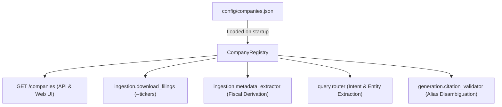

# Onboarding New Companies & Tickers to Financial RAG

> **Zero-Code Onboarding**: The system is fully data-driven. Adding support for any US-listed public company requires editing **only** [`config/companies.json`](file:///home/deepak/rag-project/config/companies.json) — no Python scripts or frontend files need to be modified.

---

## Architecture Overview

Company configurations are decoupled from business logic:
- **`config/companies.json`**: Central JSON configuration defining company metadata, SEC CIKs, fiscal calendar structures, and entity aliases.
- **`CompanyRegistry` (`config/companies.py`)**: Singleton registry providing dynamic lookups, fiscal period derivation, and alias resolution.
- **`FiscalResolver` (`query/fiscal_resolver.py`)**: Normalizes user queries ("2025 results", "Q3 earnings") into SEC filing periods according to each company's fiscal calendar.
- **`CitationIntegrityValidator` (`generation/citation_validator.py`)**: Dynamically reads aliases to prevent cross-entity citation warnings when subsidiaries/segments are cited.
- **`QueryRouter` (`query/router.py`)**: Dynamically resolves subsidiary and brand mentions to parent tickers.
- **Web UI & API (`/companies`)**: Frontends and clients dynamically populate company pickers at runtime.



---

## Step-by-Step Onboarding Guide

### Step 1: Look Up the Company's SEC CIK
Every public company registered with the SEC is assigned a 10-digit Central Index Key (CIK).
1. Visit the [SEC EDGAR Company Search](https://www.sec.gov/edgar/searchedgar/companysearch).
2. Search by company name or ticker symbol.
3. Note the CIK, ensuring it is padded to 10 digits with leading zeros (e.g. `0000320193` for Apple).

### Step 2: Determine Fiscal Year-End Month
Public companies operate on different fiscal calendars:
- **January (Month `1`)**: NVIDIA (NVDA), Walmart (WMT). An annual Form 10-K filed in March 2025 covers Fiscal Year 2025 (ending Jan 2025).
- **June (Month `6`)**: Microsoft (MSFT).
- **September (Month `9`)**: Apple (AAPL).
- **December (Month `12`)**: Netflix (NFLX), UnitedHealth Group (UNH), Amazon (AMZN), Meta (META).

*Where to check*: Open the company's latest Form 10-K on EDGAR and check the title page for:
`"For the fiscal year ended [Month Day, Year]"`.

### Step 3: Identify Brand Aliases & Operating Subsidiaries
To ensure high-precision citation verification and routing, collect key brand names, ticker variations, and major operating subsidiaries:
- **Parent**: Alphabet (`GOOGL`) → Aliases: `["google", "alphabet", "deepmind", "youtube", "waymo"]`
- **Parent**: UnitedHealth Group (`UNH`) → Aliases: `["optum", "united health", "unitedhealthcare", "change healthcare"]`
- **Parent**: Meta Platforms (`META`) → Aliases: `["meta", "facebook", "instagram", "whatsapp", "oculus", "threads"]`
- **Parent**: Amazon (`AMZN`) → Aliases: `["amazon", "aws", "prime video", "twitch"]`

### Step 4: Add Entry to `config/companies.json`
Open [`config/companies.json`](file:///home/deepak/rag-project/config/companies.json) and add the company profile:

```json
{
  "ticker": "GOOGL",
  "name": "Alphabet Inc.",
  "cik": "0001652044",
  "sector": "Communication Services / Interactive Media",
  "fiscal_year_end_month": 12,
  "download_start_date": "2024-01-01",
  "default_portfolio": false,
  "aliases": ["google", "alphabet", "deepmind", "youtube", "waymo"]
}
```

#### Field Specifications:
| Field | Type | Required | Description |
|---|---|:---:|---|
| `ticker` | `string` | Yes | Standard stock ticker symbol in uppercase (e.g., `"GOOGL"`). |
| `name` | `string` | Yes | Full corporate name (e.g., `"Alphabet Inc."`). |
| `cik` | `string` | Yes | 10-digit zero-padded SEC EDGAR CIK identifier. |
| `sector` | `string` | No | GICS industry sector for classification and metadata filtering. |
| `fiscal_year_end_month` | `integer` | Yes | Month number when fiscal year ends (1–12). Standard calendar year is `12`. |
| `download_start_date` | `string` | No | Earliest filing date to retrieve in `YYYY-MM-DD` format (default: `"2024-01-01"`). |
| `default_portfolio` | `boolean` | No | If `true`, included in default automated download when no `--tickers` flag is supplied. |
| `aliases` | `list[str]` | Yes | Lowercased list of brand names, acronyms, and operating subsidiaries. |

---

### Step 5: Download SEC Filings
Fetch Form 10-K (annual) and Form 10-Q (quarterly) filings directly from SEC EDGAR:

```bash
# Download filings for the newly added company
poetry run python -m ingestion.download_filings --tickers GOOGL

# Or download multiple companies at once
poetry run python -m ingestion.download_filings --tickers GOOGL,AAPL,MSFT

# Or download filings for all registered companies with a CIK
poetry run python -m ingestion.download_filings --all
```

Filings are saved directly to `data/company_filings/` in the format:
`<TICKER>_<FORM>_<FILING_DATE>_<ACCESSION>.htm`

---

### Step 6: Ingest and Index Documents
Run the production ingestion pipeline to parse HTML tables, extract GAAP financial facts, generate parent-child chunk embeddings, update BM25 index, and extract Knowledge Graph relations:

```bash
# Full indexing (Embeddings + BM25 + Knowledge Graph)
poetry run python -m ingestion.pipeline

# Or fast dev indexing (BM25 + Qdrant vectors without LLM enrichment)
poetry run python -m ingestion.pipeline --fast
```

The pipeline automatically inspects `data/company_filings/` and indexes any newly downloaded filings incrementally without re-indexing unchanged documents.

---

### Step 7: Verify Integration

#### 1. Verify via API
Start the server and check the `/companies` endpoint:
```bash
poetry run serve
```
Test the company endpoint:
```bash
curl http://localhost:8000/companies/GOOGL
```
Expected response:
```json
{
  "ticker": "GOOGL",
  "name": "Alphabet Inc.",
  "cik": "0001652044",
  "sector": "Communication Services / Interactive Media",
  "fiscal_year_end_month": 12,
  "download_start_date": "2024-01-01",
  "default_portfolio": false,
  "aliases": ["google", "alphabet", "deepmind", "youtube", "waymo"]
}
```

#### 2. Verify via Web UI
Open the web app at `http://localhost:8000/app`.
- Check the **Company** filter dropdown in the sidebar: the new company appears automatically.
- Ask a subsidiary question without specifying the ticker:
  `"What was YouTube advertising revenue in Q4 2024?"`
- Check the response:
  - Query Router detects ticker `"GOOGL"`.
  - Citation validator attributes YouTube disclosures to `GOOGL` without citation contamination warnings.

---

## Dynamic Runtime Registration (Python SDK)

If integrating into an external Python service or notebook, companies can also be registered programmatically in memory:

```python
from config.companies import CompanyRegistry

CompanyRegistry.register_company(
    ticker="ORCL",
    name="Oracle Corporation",
    cik="0001341439",
    sector="Technology / Software",
    fiscal_year_end_month=5,  # May fiscal year-end
    aliases=["oracle", "oci", "netsuite", "cerner"],
)

# Now immediately supported across routing, fiscal derivation, and citation validation
prof = CompanyRegistry.get_company("ORCL")
assert prof is not None
assert CompanyRegistry.get_alias_map()["oci"] == "ORCL"
```
