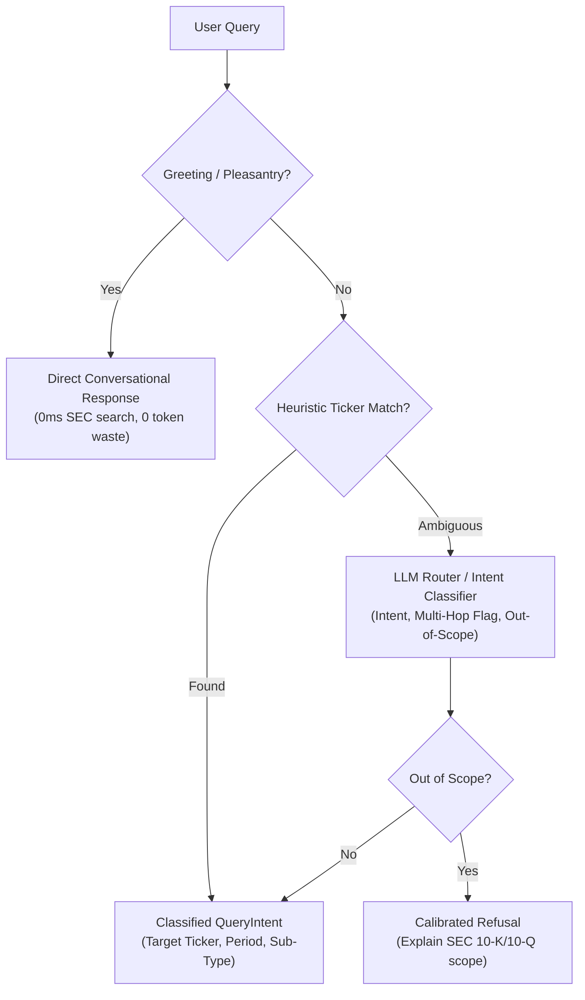

# System Architecture

> Deep technical reference for the Financial RAG System — design decisions, data flows, and component contracts.

---
## Table of Contents

1. [System Overview](#system-overview)
2. [Layer 1: Ingestion Pipeline](#layer-1-ingestion-pipeline)
3. [Layer 2: Query Transformation & Routing](#layer-2-query-transformation)
4. [Layer 3: Hybrid Retrieval](#layer-3-hybrid-retrieval)
5. [Layer 4: Answer Generation](#layer-4-answer-generation)
6. [Layer 5: Calibrated Abstention & PAL Verification](#layer-5-calibrated-abstention--pal-verification)
7. [Layer 6: API Layer & Serving Infrastructure](#layer-6-api-layer--serving-infrastructure)
8. [Configuration System](#configuration-system)
9. [Data Contracts](#data-contracts)
10. [Concurrency Model](#concurrency-model)
11. [Design Decisions & Trade-offs](#design-decisions--trade-offs)

---

## System Overview

```
User Question
     │
     ▼
┌─────────────────────────────────────────────────────────────┐
│  FinancialRAGPipeline  (rag_pipeline.py)                    │
│                                                             │
│   SemanticCache.get_cached_response(query_vector)           │
│           │ (cache miss)                                    │
│   QueryRouter.route(question) (Refusal / Ticker Extraction) │
│           │                                                 │
│   QueryDecomposer.decompose(question) (2026 Sub-Query Decomp)│
│           │                                                 │
│   QueryTransformer.transform(question)                      │
│   (HyDE [specificity-gated] + Multi-Query + Step-Back)      │
│           │                                                 │
│           ▼                                                 │
│   retrieve(transformed, qdrant, bm25, reranker)             │
│   (RRF k=60 + FlashRank Cross-Encoder + FactStore + GraphRAG)│
│           │                                                 │
│   ContextualCompressor.compress_all() (2026 Context Clean)  │
│           │                                                 │
│           ▼                                                 │
│   Generator.generate(question, retrieval_result)           │
│   (Valley context reordering + citation grounding)          │
│           │                                                 │
│           ▼ (if ungrounded)                                 │
│   Agentic Reflexion (Self-Correction loop)                  │
│           │                                                 │
│           ▼ (Strict Verification Tier / Eval)               │
│   ClaimGroundingVerifier (Sentence NLI) + PAL Calculator    │
└─────────────────────────────────────────────────────────────┘
     │
     ▼
GenerationResult (Grounded answer with citations, audit trace, & OTel telemetry)
```

### Canonical Layer Reference Table

| Layer | Name | Core Components | Key Technologies & Guarantees |
|---|---|---|---|
| **Layer 1** | **Ingestion Pipeline** | SEC EDGAR downloader, HTML/ASCII parser, structure-aware chunker, Qdrant indexer, BM25 indexer, SEC GAAP FactStore, GraphRAG extractor | Deterministic UUID5 chunk IDs, parent-child chunking (512/192 tokens), atomic financial tables, exact GAAP disclosures |
| **Layer 2** | **Query Transformation & Routing** | Heuristic fast-path classifier, LLM intent router, specificity-gated HyDE, Multi-Query expansion, Step-Back abstraction | Sub-1ms regex routing, dynamic technique selection, out-of-scope refusal probability |
| **Layer 3** | **Hybrid Retrieval & Fusion** | Batched dense vector search, BM25 sparse search, RRF (k=60), FlashRank cross-encoder reranker, GraphRAG fusion, SEC Facts injection | Zero-duplicate embedding query vector reuse, adaptive 50/50 CE/RRF table blending, authoritative audited GAAP statements |
| **Layer 4** | **Answer Generation & Context Construction** | Context builder, lost-in-the-middle valley ordering, MMR lexical deduplicator, Gemini 2.5 Flash / GPT-5 synthesis, inline citation mapping | Strict token budgets, U-shaped attention optimization, 0.92 MMR similarity threshold, inline `[N]` mapping |
| **Layer 5** | **Hallucination Fences & Verification** | Numerical Hallucination Fence, Citation Integrity Validator, AST Safe Financial Calculator (PAL), ClaimGroundingVerifier (NLI), Agentic Reflexion loop | Quantitative ±0.5% tolerance check, cross-entity citation contamination guard, deterministic math execution, bounded self-correction |
| **Layer 6** | **API & Serving Infrastructure** | FastAPI endpoints, SSE streaming with typed frames (`log`, `token`, `done`), Qdrant Semantic Cache (TTL + invalidation), OpenTelemetry tracer | Sub-millisecond cache hits, P50/P90/P95/P99 rolling latency telemetry, structured audit JSONL |

**Thread safety**: All pipeline components are stateless between calls. Internal model singletons (Model-agnostic LLM/embedding client `config.llm_client`, BM25, FlashRank) are safe for concurrent reads after first initialisation. Parallel `ask()` calls across threads are fully supported.

---

## Layer 1: Ingestion Pipeline

### Data Flow

```
SEC EDGAR API (JSON submissions & Archives endpoints)
        │
        │ CIK lookup → Form 10-K / 10-Q filing list → accession numbers
        ▼
Raw Filing HTML (data/company_filings/*.htm)
        │
        ▼  parse_html()
ParsedDocument {ticker, date, raw_text, sections[]}
        │
        │  extract_metadata()
        ▼
DocumentMetadata {ticker, company, date, year, quarter, fiscal_period, form_type}
        │
        │  create_parent_child_chunks()
        ▼
list[Chunk]  (parent + child + table chunks)
        │
        ├──▶  FactStore Extraction       ──▶ data/facts_store.json (Structured GAAP facts)
        ├──▶  IngestionStateManager      ──▶ data/ingestion_state.db (SQLite SHA-256 hashes)
        ├──▶  Anthropic Contextual Retrieval (_generate_chunk_context prepend)
        ├──▶  Knowledge Graph Extraction ──▶ data/knowledge_graph.json
        ├──▶  Dense Vector Indexing      ──▶ Qdrant collection (text-embedding-004 768-dim / text-embedding-3-small 1536-dim)
        └──▶  BM25 Financial Indexing    ──▶ bm25_index.pkl + bm25_corpus.pkl
```

### Chunking Architecture

The chunker implements a **three-stage parent/child architecture** tuned for financial documents:

**Stage 1 — Structure-aware section splitting**

Financial section headers act as hard boundaries (MD&A, Risk Factors, Segment Results, Financial Statements). A line qualifies as a header only if:
1. It matches a financial/markdown header pattern (Revenue, Segment Results, Outlook, etc.)
2. It contains ≤8 words (prevents long prose sentences matching header patterns)

Markdown tables are detected via `_is_table_block()` and kept **strictly atomic** — they are never split across parent or child chunks. This preserves tabular financial data integrity (revenue by segment, balance sheet items, etc.).

**Stage 2 — Parent chunks** (~512 tokens)
- 64-token overlap between consecutive parents
- Each parent carries a contextual prefix: `[Context: NVDA (NVIDIA) | SEC Form 10-K | Fiscal Period: FY2025 | Date: 2025-01-26 | Section: Segment Results]`
- Oversized sections are split into word-budget pages before accumulation, maintaining overlap continuity

**Stage 3 — Child chunks** (~192 tokens)
- Sentence boundaries are respected — no mid-sentence splits via `_split_into_sentences()`
- 48-token overlap between consecutive children (scaled with child target)
- Contextual prefix re-applied to every child (enables context injection at embedding time)
- Table parents are **not** split into children — they are indexed directly as atomic parent chunks
  to preserve tabular financial data integrity (no duplicate vector space waste)

**Anthropic-Style Contextual Retrieval (Enabled by Default)**:
For each indexable chunk, an LLM call summarizes the chunk's situated context relative to the broader filing before embedding, eliminating ambiguity for isolated figures.

**Why parent/child?**

| Concern | Solution |
|---------|---------|
| Embedding precision | Small 192-token children → more precise dense & sparse retrieval |
| Generation context | 512-token parents → richer context for LLM answer synthesis |
| Cost control | Embed children only; fetch parents lazily at retrieval time |
| Boilerplate dilution | Section boundaries prevent legal disclaimers contaminating financial content |

### In-Memory Store-State Auto-Checkpointing & Fault Tolerance

The ingestion pipeline uses **direct, store-derived state inspection** (`IngestionStoreState`) rather than external sidecar text checkpoint files.

#### 1. How Chunk IDs are Made Deterministic

In `ingestion/chunker.py`, chunk IDs are constructed using **UUID v5** (a deterministic SHA-1 cryptographic hash of the ticker and filing date):

```python
def _make_chunk_id(ticker: str, date: str, index: int, suffix: str = "") -> str:
    ns = uuid.uuid5(uuid.NAMESPACE_DNS, f"{ticker}:{date}")
    base = f"{ticker}_{date}_{str(ns)[:8]}_{index}"
    return f"{base}_{suffix}" if suffix else base
```

- **Parent Chunks**: `NFLX_2025-01-27_c0f682a1_0`
- **Table Chunks**: `NFLX_2025-01-27_c0f682a1_1_tbl`
- **Child Chunks**: `NFLX_2025-01-27_c0f682a1_0_c0`, `NFLX_2025-01-27_c0f682a1_0_c1`, etc.

Because `ticker`, `date`, and section breakdown are fixed for a given file, **re-parsing the file produces the exact same chunk IDs every single time.**

#### 2. How Skipping Works for Each Component

In `ingestion/pipeline.py`, `IngestionStoreState` queries the current state of Qdrant, BM25, and Knowledge Graph on startup into three in-memory lookup sets:
- `store_state.qdrant_chunk_ids`
- `store_state.bm25_chunk_ids`
- `store_state.kg_chunk_ids`

When a file is evaluated in `_process_document()`:

##### A. Vector DB (Qdrant)
- **Check**: `missing_qdrant = [c for c in indexable_chunks if c.chunk_id not in store_state.qdrant_chunk_ids]`
- **Skipping**: If `missing_qdrant` is empty, **0 OpenAI embedding API calls** and **0 Qdrant upserts** are performed for this document.
- **Idempotency Guarantee**: In `ingestion/indexer.py`, Qdrant Point IDs are generated deterministically via `uuid5(NAMESPACE_DNS, chunk.chunk_id)`. Even if Qdrant receives an upsert for an existing point, Qdrant updates it in place without creating duplicate points.

##### B. BM25 Keyword Index
- **Check**: `missing_bm25 = [c for c in indexable_chunks if c.chunk_id not in store_state.bm25_chunk_ids]`
- **Skipping**: If `missing_bm25` is empty, **0 BM25 tokenization** and **0 corpus appends** occur for this document.
- **Deduplication Guarantee**: Only chunks missing from `store_state.bm25_chunk_ids` are appended to `bm25_texts` and `bm25_corpus.pkl`.

##### C. Knowledge Graph
- **Check**: `kg_needed = kg_enabled and not any(c.chunk_id in store_state.kg_chunk_ids for c in parent_chunks)`
- **Skipping**: If `parent_chunks` are already represented in `store_state.kg_chunk_ids`, **0 LLM Knowledge Graph extraction calls** are made for this document.
- **Deduplication Guarantee**: In `knowledge_graph/models.py`, `KnowledgeGraph.add_entity()` and `add_relationship()` deduplicate entities by `canonical_key` (`type::ticker::name`) and relationships by `edge_key` (`source--relation-->target`) in $O(1)$ time.

#### 3. Component Skipping Summary Matrix

| Target Store | Lookup Identifier | Action if Fully Present | Action if Partially Ingested |
| :--- | :--- | :--- | :--- |
| **Vector DB (Qdrant)** | `chunk_id` in point payload | Skip OpenAI embedding API & Qdrant upsert | Embed & upsert only missing `chunk_id`s |
| **BM25 Index** | `chunk_id` in corpus dict | Skip tokenization & corpus append | Tokenize & append only missing `chunk_id` entries |
| **Knowledge Graph** | `chunk_id` in entity/relation | Skip LLM entity & relation extraction | Run LLM extraction only for unindexed parent chunks |

#### 4. Fault Recovery
If an ingestion run crashes midway (e.g., Qdrant upserts succeed but BM25/KG fails), a subsequent run automatically detects completed chunk IDs, skips re-embedding, and safely completes only the missing BM25 or KG stages.

### BM25 Corpus Invariant

The two files `bm25_index.pkl` and `bm25_corpus.pkl` maintain a strict parallel-array invariant:

```
bm25_index.corpus[i]  ←→  bm25_corpus[i]  (always same length, same order)
```

The pipeline validates this invariant before writing. Breaking it would cause the retrieval layer to resolve BM25 rank indices to wrong chunk metadata.

---

## Layer 2: Query Routing & Transformation

### 1. Query Router & Intent Classification (`query/router.py`)

Before transforming queries or executing vector search, every incoming query passes through Layer 2's structured router.



- **Conversational Greeting & Pleasantry Heuristic**:
  - Fast-path regex / keyword classifier detects greetings (`"hello"`, `"hi"`, `"good morning"`), pleasantries (`"thank you"`, `"thanks"`, `"great job"`), and conversational continuations.
  - Returns an immediate polite conversational response without querying vector databases, avoiding irrelevant SEC retrieval or hallucinated filings.
- **Dynamic Entity & Fiscal Period Resolution**:
  - Resolves corporate tickers (e.g. `NVDA`, `WMT`, `NFLX`, `UNH`, `AAPL`) using the dynamic `CompanyRegistry` (`config/companies.json`).
  - Identifies fiscal periods (`FY2025`, `Q3 2024`) via `FiscalPeriodResolver`, mapping calendar dates to fiscal calendars (e.g. NVIDIA/Walmart January fiscal year-ends).
- **Multi-Turn Conversational Context Resolution**:
  - When invoked with an active `session_id`, resolves contextual pronouns and follow-up inquiries (e.g., *"What about operating margins?"* following a question on Walmart) using previous conversational turns.

---

### 2. Query Transformation (`query/transformer.py`)

### Motivation

The **query-document semantic gap** is the core challenge in RAG: a user's natural language question lives in a different part of embedding space than a formal 10-K/10-Q filing passage. Layer 2 bridges this gap with three complementary techniques.

### Architecture

```
user question: "What was Apple's revenue in Q4 2024?"
        │
        ├──▶ [Task 1] _run_hyde()         → hypothetical answer passage
        ├──▶ [Task 2] _run_multi_query()  → 3 rephrasings
        └──▶ [Task 3] _run_stepback()     → abstract question
                │
                │ asyncio.gather(*tasks, return_exceptions=True)
                ▼
        TransformedQuery {
            original        = "What was Apple's revenue in Q4 2024?"
            hyde_document   = "Apple Inc. reported total net sales of $X billion for..."
            multi_queries   = [original, rephrasing1, rephrasing2, rephrasing3]
            stepback_query  = "What is Apple's revenue breakdown by segment?"
            failed_techniques = []  # populated only on partial failure
        }
```

### Technique Design

**HyDE (Hypothetical Document Embeddings)**

Generates a passage that mimics an actual SEC 10-K/10-Q filing section in register and vocabulary. When embedded with OpenAI `text-embedding-3-small`, this synthetic passage maps into the same region of embedding space as real document chunks — closing the semantic gap at the source.

Temperature: `0.3` — moderate creativity to generate plausible-sounding passages without hallucinating too wildly.

**Multi-Query**

Generates 3 rephrasings with deliberately varied vocabulary axes:
- Version 1: Formal analyst language (`revenue → net revenue`, `guidance → forward outlook`)
- Version 2: Management commentary style (`what did management say about X`)
- Version 3: Short keyword-style (`AAPL revenue Q4 2024`)

Temperature: `0.7` — higher variance ensures the rephrasings actually differ in vocabulary.

**Step-Back Prompting**

Generates a broader, more abstract question. Purpose: retrieve foundational context chunks that the specific question would miss — segment definitions, methodology notes, management commentary on strategy.

Temperature: `0.1` — near-deterministic, same question should produce same abstraction.

### Graceful Degradation

All three techniques execute concurrently via `asyncio.gather(*tasks, return_exceptions=True)`. If any technique fails:
- The failed technique's output falls back to the original query
- `failed_techniques` list is populated (visible in `/query?verbose=true` response and logs)
- Pipeline execution always completes — partial degradation is not a fatal error

### In-Memory LRU Cache

A simple dict-based LRU cache (size: `RAG_QUERY_TRANSFORM_CACHE_SIZE`, default 256) keyed by `sha256(query.strip().lower())`. Eliminates redundant LLM calls for:
- Repeated questions in evaluation harness runs
- Calibrated Abstention re-generation loops on the same question
- UI demos with repeated queries

---

## Layer 3: Hybrid Retrieval

### Search Strategy

```
TransformedQuery + Identified Ticker/Period
        │
        ├──▶ Pre-computed Query Vector Reuse ──▶ Reuses semantic cache query vector (0ms redundant embedding)
        │
        ├──▶ SEC iXBRL FactStore ─────────────▶ Deterministic GAAP Fact Table (0% hallucination)
        │                                        (Injected directly into top of context)
        ├──▶ Dense (Batched Embeddings) ──────▶ Single API call (_embed_batch) for:
        │    ├── hyde_document (if enabled)    → 1× Qdrant search (10 results)
        │    ├── multi_queries[0..3]           → 4× Qdrant searches (10 each)
        │    └── stepback_query                → 1× Qdrant search (10 results)
        ├──▶ BM25 Keyword Search
        │    ├── multi_queries[0..3]           → 4× BM25 searches (10 each)
        │    └── stepback_query                → 1× BM25 search (10 results)
        └──▶ GraphRAG Entity Retrieval ───────▶ Traverses knowledge graph relationships & injects chunks
                │
                │ Total raw pool: up to 6×10 dense + 5×10 BM25 + GraphRAG = ~110 hits
                │ After deduplication: 30–60 unique chunks
                ▼
        RRF Fusion  (k=60, standard default from Cormack et al. 2009)
                │
                │ score(chunk) = Σ 1/(60 + rank_i) across all result lists
                ▼
        Top 20 candidates (top_k_pre_rerank)  →  FlashRank cross-encoder reranker
                │
                │ Adaptive CE/RRF Blending (65/35 default, 50/50 for table-heavy candidate sets)
                ▼
        Top 5–8 results (top_k_final)  →  Late parent fetch
                │
                ▼
        list[SearchResult] with parent_text populated
```

> [!NOTE]
> **Retrieval Architecture & Cross-Encoder vs. Late-Interaction Design Decision**:
> During initial architectural design, token-level late-interaction multi-vector scoring (ColBERT MaxSim) was evaluated against cross-encoder reranking. In production, full cross-encoder reranking via FlashRank (`ms-marco-MiniLM-L-12-v2` ONNX CPU) was chosen as the definitive primary reranking mechanism for three critical engineering reasons:
> 1. **Cross-Attention Table Geometry**: Full multi-head cross-attention over concatenated query-document tokens explicitly models the relationship between metric labels (e.g., "Data Center Revenue") and multi-period tabular columns (e.g., "Q3 2024" vs "Q3 2023"). ColBERT late-interaction token MaxSim lacks full joint cross-attention and frequently conflates neighboring financial columns.
> 2. **Sub-15ms Latency on Commodity CPU**: FlashRank runs optimized ONNX Runtime binaries with zero GPU dependencies and negligible memory footprint, reranking top-25 candidate pools in <15ms.
> 3. **Index Efficiency & Cost**: Storing single 1536-dim dense vectors avoids the 100–150× vector multiplication overhead of token-level multi-vector stores. (See ADR-005 & ADR-012 in `docs/DESIGN_DECISIONS.md`).


### Batched Query Embeddings (`_embed_batch`)

A common bottleneck in multi-query RAG is sequential embedding calls: generating vector embeddings for the HyDE document, 3 rephrasings, and the stepback query sequentially takes $5 \times 150\text{ms} = 750\text{ms}$.

In `retrieval/searcher.py`, all query texts are aggregated into a single batch and dispatched in a single call via `config.llm_client.aembed` (routing directly to Vertex AI REST or OpenAI). This slashes query embedding overhead from ~750ms to ~160ms (a 4.5× speedup) while guaranteeing identical vector representations.

### Deterministic SEC iXBRL FactStore Injection

For quantitative queries involving standard financial metrics (Revenue, Operating Margin, Net Income, Diluted EPS, Cash from Operations), vector retrieval can suffer subtle tabular misalignments (e.g. confusing 3-month vs 9-month ended columns).

The `FactStore` (`ingestion/facts_store.py`, serialized at `data/facts_store.json`) indexes exact XBRL numerical disclosures extracted from SEC EDGAR. When `retrieve()` detects a financial query targeting an identified company and period:
1. `FactStore` queries exact GAAP facts for `(ticker, year, quarter)`.
2. A deterministic Markdown fact table is formatted and prepended to the retrieved context chunks with rank 0.
3. The LLM synthesizes the final answer referencing the exact audited figures, guaranteeing 0% calculation and attribution hallucination.

### RRF Fusion

Reciprocal Rank Fusion scores each unique chunk across all result lists:

```python
score(chunk_id) = sum(1.0 / (k + rank_i) for rank_i in all_rankings_containing_chunk_id)
```

`k=60` is the standard default. Chunks appearing in multiple result lists (both dense and BM25) accumulate higher scores, naturally promoting robust matches.

### FlashRank Reranking

After RRF, the top `top_k_pre_rerank=20` candidates are passed to FlashRank's `ms-marco-MiniLM-L-12-v2` cross-encoder:

- **Model**: MiniLM cross-encoder (`ms-marco-MiniLM-L-12-v2`), fully local via ONNX
- **Input**: `(query_original, parent_text_or_child_text)` pairs
- **Output**: Relevance scores from 0–1 (higher = more relevant)
- **Latency**: ~8–15 ms for 20 candidates on CPU

The cross-encoder is significantly more accurate than cosine similarity for relevance scoring because it attends to interactions between the query and document tokens, not just their independent embeddings.

When disabled (`RAG_RERANKER_ENABLED=false`), results fall through sorted by RRF score.

### Late Parent Fetch

After reranking determines the final `top_k_final=8` child chunks, a **single batch Qdrant scroll** fetches all corresponding parent chunks:

```python
# One batch call, not N individual lookups
scroll_result, _ = client.scroll(
    collection_name=...,
    scroll_filter=Filter(must=[FieldCondition(key="chunk_id", match=MatchAny(any=parent_ids))]),
    limit=len(parent_ids) + 10,
)
```

This replaces each child's 192-token text with its 512-token parent text. The generation layer receives full context without paying the cost of embedding large parent chunks.

### Metadata Filtering

`MetadataFilter(ticker, year, quarter)` is applied at both Qdrant (server-side filter pushdown) and BM25 (Python-side post-filter) levels. Qdrant payload indices are created during `init_qdrant()` for `ticker` (keyword), `year` (integer), and `quarter` (keyword), ensuring O(log n) filtered queries.

---

## Layer 4: Answer Generation

### Context Window Construction

```python
# generation/context_builder.py

1. Deduplicate by parent_id
   (two children sharing a parent → keep higher rerank_score one)

2. Valley reorder  (lost-in-the-middle mitigation)
   even-indexed ranks → front of context
   odd-indexed ranks  → back of context, reversed
   → rank-1 at position 0, rank-2 at last position

3. Greedy token budget allocation
   add blocks until max_context_tokens (8192) exhausted
   if first chunk alone exceeds budget → hard truncate to fit

4. Format as numbered [1]..[N] blocks
   "--- [1] AAPL | Q4 2024 | Revenue ---\n<parent_text>"
```

**Lost-in-the-Middle Mitigation**: Based on Liu et al. (2023), LLM attention follows a U-shaped pattern — strong at start and end of context, weak in the middle. Valley ordering ensures rank-1 (most relevant) occupies position 0 (highest attention) and rank-2 occupies the last position (second-highest attention).

### Citation Contract

The generation system prompt establishes a strict citation contract with the LLM:

```
Every factual claim MUST be followed immediately by an inline citation: [1], [2], etc.
For claims supported by multiple sources: [1][2]  (no space, no comma)
Do NOT invent a citation number that does not appear in the provided context.
```

Post-generation, `_extract_citations()` uses regex `\[(\d+)\]` to scan the answer and map each cited index to its corresponding `SearchResult`. Out-of-range indices (hallucinated citations) are logged with a warning and skipped — never crash.

### Grounding Check

`_is_grounded()` scans the answer text for 13 phrases that signal insufficient context:

```python
UNGROUNDED_PHRASES = (
    "do not contain sufficient information",
    "cannot determine",
    "not mentioned in",
    ...
)
```

`GenerationResult.grounded = False` signals downstream layers that Agentic Reflexion (self-correction re-retrieval) or Calibrated Abstention should trigger to eliminate hallucination.

### Retry Strategy

`_call_llm()` uses `tenacity` with exponential backoff:
- Retries on: `RateLimitError`, `APITimeoutError`
- Propagates immediately on: 4xx `APIError` (unrecoverable — retrying wastes money)
- Max retries: 3 (configurable via `RAG_GENERATION_MAX_RETRIES`)

### Strict Verification & Quantitative Hallucination Defense

For compliance-critical production environments, the generator supports a dual-tier verification regime:

1. **Fast Heuristic Tier** (default):
   - Fast lexical citation extraction (`[1]..[N]`) with regex mapping.
   - Negative phrase scanning (`UNGROUNDED_PHRASES`).
   - Near-zero latency overhead (<5ms).

2. **Strict Verification Tier** (`RAG_GENERATION_STRICT_VERIFICATION=true` or `strict_verification=True`):
   - **NLI Claim-Level Grounding** (`ClaimGroundingVerifier`): Every sentence in the generated answer is verified against the cited context chunks to compute a quantitative `grounding_score` (0.0 to 1.0) and partition claims into `verified_claims` vs `ungrounded_claims`.
   - **Quantitative Hallucination Fence** (`NumericalHallucinationFence`): Regex extraction of all numerical figures, dollar values, percentages, and metrics. Normalizes figures with scale multipliers (e.g., `$14.2B` matches `$14,200M`) and cross-checks every number against the retrieved context or verified Program-Aided Language (PAL) mathematical calculations. Flagged numbers are recorded in `numerical_hallucination_warnings`.
   - **Citation Integrity Validation** (`CitationIntegrityValidator`): Ensures that entity names (tickers, companies) mentioned in each claim correspond accurately to the cited parent document, eliminating cross-entity hallucination.
   - **Context MMR Deduplication** (`RAG_CONTEXT_MMR_THRESHOLD=0.92`): Eliminates near-duplicate context chunks prior to prompt assembly, preserving prompt budget for diverse evidence.

---

## Layer 5: Calibrated Abstention & PAL Verification

### Architecture & Motivation

In production financial intelligence, **unverified web search fallback is unacceptable**: external web queries introduce severe hallucination risks, non-compliant data leaks, and unpredictable latency.

Instead, the system employs **Calibrated Abstention** and **Program-Aided Language (PAL) deterministic calculation**:

```
                    ┌─────────────────────────────┐
                    │  GenerationResult received   │
                    └─────────────┬───────────────┘
                                  │
                   ┌──────────────▼──────────────┐
                   │ Sentence Claim Extraction   │
                   │ (OpenAI Structured Outputs) │
                   └──────────────┬──────────────┘
                                  │
                   ┌──────────────▼──────────────┐
                   │ ClaimGroundingVerifier      │
                   │ NLI Entailment vs Context   │
                   └──────────────┬──────────────┘
                                  │
               ┌──────────────────┴──────────────────┐
               ▼                                     ▼
        Math Assertion?                       Factual Text Claim?
               │                                     │
    ┌──────────▼──────────┐               ┌──────────▼──────────┐
    │ SafeFinancialCalc   │               │ Contextual NLI      │
    │ AST Sandbox Eval    │               │ Entailment Check    │
    └──────────┬──────────┘               └──────────┬──────────┘
               │                                     │
               └──────────────────┬──────────────────┘
                                  │
               ┌──────────────────┼──────────────────┐
               │                                     │
        Fully Grounded                        Ungrounded Claims?
               │                                     │
            CORRECT                              CALIBRATED
       Return Answer with                        ABSTENTION
      Verified Citations                    Graceful refusal to
                                            prevent hallucination
```

### ClaimGroundingVerifier (`generation/grounding_verifier.py`)

- **Sentence-Level NLI Verification**: Deconstructs answers into atomic factual claims and verifies strict entailment against the retrieved SEC filing excerpts using OpenAI Structured Outputs (`GroundingReportModel`).
- **Hallucination Detection**: Flags ungrounded statements and sets `grounded = False` to trigger calibrated abstention or agentic reflexion.

### Agentic Reflexion (Self-Correction Loop)

When an initial generation fails grounding verification (`grounded = False`) but documents exist in the index (`retrieval_failed = False`), the pipeline initiates an autonomous **Agentic Reflexion** self-correction loop (`rag_pipeline.py` L427–453):

1. **Reflexion Query Formulation**: Formulates a targeted search prompt emphasizing numerical verification:
   ```python
   reflexion_query = f"{question} (Find specific details, numerical values, and context to support the answer)"
   ```
2. **Targeted Transform & Re-Retrieval**: Executes Multi-Query and Step-Back expansions, retrieving with expanded candidate depth.
3. **Re-Generation & Verification**: Re-synthesizes the answer against the enriched context and repeats NLI claim verification.
4. **Calibrated Abstention**: If the answer remains ungrounded after reflexion, the pipeline returns a calibrated abstention with explicit disclaimer rather than hallucinating.

### Semantic Caching Layer (`retrieval/semantic_cache.py`)

To eliminate redundant LLM inference costs and optimize P95 response latency, the pipeline incorporates a Qdrant-backed **Semantic Cache**:
- **Similarity Threshold**: Evaluates cosine similarity of new queries against cached embeddings ($\ge 0.98$ cosine similarity threshold).
- **Sub-15ms Latency**: Serves verified past answers and citations instantly with $0.00 LLM cost.
- **Payload Cache**: Stores serialized `GenerationResult` objects with all verified citations and diagnostics.

---

## Layer 6: API Layer & Serving Infrastructure

### Input Guardrails & Security Filtering (`query/guardrails.py`)

All incoming queries are processed through a multi-tier security filter before execution:
- **Prompt Injection Defense**: Detects adversarial override attempts, jailbreak patterns (e.g. DAN mode), and raw instruction token smuggling (`<|im_start|>`, `<<SYS>>`).
- **PII Detection & Redaction**: Flags and masks Social Security Numbers (SSN) and credit card numbers validated via the Luhn mod-10 algorithm.
- **Token Budget & DoS Protection**: Rejects queries exceeding maximum token lengths via `tiktoken` to prevent context exhaustion attacks.

### Async Execution Model

The FastAPI event loop and RAG pipeline are natively asynchronous (`async`/`await`). Non-async operations (BM25 sparse ranking, FlashRank ONNX cross-encoding) run in background worker threads via `asyncio.to_thread` to prevent event loop starvation:

```python
# Non-blocking async retrieval
retrieval_result = await asyncio.to_thread(
    retrieve,
    query=transformed,
    qdrant_client=self.qdrant_client,
    metadata_filter=metadata_filter,
)
```

### Native SSE Streaming Architecture

Streaming operates natively as an `AsyncIterator[str | dict[str, Any]]` from the LLM provider through the generation layer and pipeline directly into FastAPI's `StreamingResponse`. This eliminates thread-pool producer bottlenecks, blocking queues, and thread starvation risks:

```
FastAPI Consumer (_consume)                 Pipeline Streamer (ask_streaming)
─────────────────────────────               ─────────────────────────────────
StreamingResponse(_consume())               pipeline.ask_streaming()
  async for item in stream:                  ├── yield {"log": "Transforming..."}
    if isinstance(item, dict):               ├── yield {"log": "Retrieving..."}
      payload = json.dumps(item)             ├── async for token in generator:
    else:                                    │     yield token
      payload = json.dumps({"token": item})  └── yield {"type": "done", ...}
    yield f"data: {payload}\n\n"
  yield "data: [DONE]\n\n"
```

#### Typed SSE Streaming Frames

The streaming interface delivers three distinct structured frame types over SSE:

1. **Progress Log Frame (`log`)**:
   Emitted at pipeline phase transitions for real-time frontend status updates.
   ```json
   {"log": "Transforming query using HyDE and multi-query..."}
   ```

2. **Incremental Token Frame (`token`)**:
   Emitted as tokens arrive from the LLM completion stream. If served from semantic cache, the cached answer is streamed word-by-word to maintain consistent UI animation.
   ```json
   {"token": "Microsoft's "}
   ```

3. **Terminal Structured Metadata Frame (`done`)**:
   Emitted immediately prior to stream completion (`data: [DONE]\n\n`). Delivers verified citations, grounding status, and distributed tracing IDs so UI clients can render citation badges and source inspection drawers without an extra HTTP request:
   ```json
   {
     "type": "done",
     "grounded": true,
     "cache_hit": false,
     "trace_id": "tr-4f9e8a1b2c",
     "citations": [
       {
         "index": 1,
         "ticker": "MSFT",
         "fiscal_period": "FY2024",
         "section_title": "Item 7. MD&A",
         "excerpt": "Intelligent Cloud revenue grew 20% to $105.4 billion..."
       }
     ]
   }
   ```

Headers set on SSE response:
- `Content-Type: text/event-stream`
- `Cache-Control: no-cache`
- `Connection: keep-alive`
- `X-Accel-Buffering: no` (disables Nginx response buffering for real-time token delivery)
- `X-Request-ID: <uuid>` (stamped for distributed tracing)

### Pure ASGI Middleware Architecture

The API layer implements pure ASGI middleware rather than Starlette's `BaseHTTPMiddleware`:

- **`TimingMiddleware`**: Stamps `X-Response-Time` and records Prometheus request durations.
- **`RequestIDMiddleware`**: Propagates or generates `X-Request-ID` across all spans.
- **`UserContextMiddleware`**: Resolves authenticated or guest `user_id` and `tenant_id` from request state or `X-User-ID` / `X-Tenant-ID` headers for tenant isolation.
- **`RateLimitMiddleware`**: In-memory sliding window rate limiting with RFC-compliant `X-RateLimit-*` headers.

**Why pure ASGI (not BaseHTTPMiddleware)?**

`BaseHTTPMiddleware` uses `anyio.create_task_group()` internally. When a route raises and the exception handler sends a 500 response, the inner task group re-raises via `ExceptionGroup` / `collapse_excgroups()` — crashing `TestClient` instead of returning the 500. Pure ASGI middleware wraps `send()` directly and never participates in exception propagation.

### Conversational Session Management & Chat Store (`api/chat_store.py`)

For multi-turn enterprise chatbot workflows, the backend provides stateful conversational session tracking:
- **`ChatStore` Singleton**: Thread-safe storage layer supporting in-memory caching and persistent SQLite storage.
- **Tenant & User Isolation**: All sessions are indexed by `(user_id, session_id)`. Operations enforce strict ownership boundaries so users cannot inspect or mutate other users' conversation histories.
- **Sliding-Window History Pruning**: Automatically prunes older conversational turns when message count exceeds sliding window thresholds (`max_history_turns`), preventing prompt bloat and context window exhaustion while preserving critical conversational anchor context.
- **Turn Attribution**: Each assistant message stores the verified answer prose, discrete citations, PAL arithmetic calculations, and grounding confidence scores, allowing the frontend to reconstruct rich interactive cards on reload.

### Health Check Hierarchy

| Endpoint | Depth | Kubernetes Use | Latency |
|----------|-------|---------------|---------|
| `/health/live` | Process alive check | Liveness probe | <1 ms |
| `/health/ready` | Pipeline singleton check | Readiness probe | <1 ms |
| `/health/` | Full dependency probe | Dashboard / alerting | ~50–200 ms |

The readiness probe accurately reflects model loading state — during the 10–20s startup window, `/health/ready` returns 503, causing Kubernetes to hold traffic until models are loaded.

### Exception Handler Mapping

| Exception | HTTP Status | Notes |
|-----------|------------|-------|
| `RequestValidationError` | 422 | Pydantic field validation |
| `ValueError` | 400 | Domain errors (unknown ticker, empty question) |
| `AuthenticationError` | 401 | Invalid OpenAI API key |
| `RateLimitError` | 429 | `Retry-After: 10` header added |
| `FileNotFoundError` | 503 | BM25 index or Qdrant collection missing |
| `APITimeoutError` | 504 | OpenAI timeout after all retries |
| `APIConnectionError` | 502 | OpenAI network error |
| `Exception` (catch-all) | 500 | Unexpected errors — full traceback in logs |

All error responses share the same JSON shape:
```json
{"error": "<category>", "detail": "<message>", "request_id": "<uuid>"}
```

### Prometheus Metrics

The system uses a **dedicated `RAG_REGISTRY`** (not `prometheus_client.REGISTRY`). This prevents "Duplicated timeseries" errors when pytest creates multiple `TestClient` instances per session, each triggering `create_app()`. The `/metrics` endpoint serves only this custom registry.

---

## Configuration System

All configuration lives in `config/settings.py` as frozen `@dataclass` classes. Every field defaults to a sensible production value but is overridable via environment variable.

```
Settings
  ├── QueryRouterConfig       (RAG_QUERY_ROUTER_*)
  ├── QueryTransformConfig    (RAG_QUERY_TRANSFORM_*)
  ├── GenerationConfig        (RAG_GENERATION_*)
  ├── EmbeddingConfig         (RAG_EMBEDDING_*)
  ├── RetrievalConfig         (RAG_RETRIEVAL_*)
  ├── RerankerConfig          (RAG_RERANKER_*)
  ├── InfraConfig             (QDRANT_URL, OPENAI_API_KEY, SEC_USER_AGENT)
  ├── EvaluationConfig        (RAG_EVAL_*)
  ├── ObservabilityConfig     (RAG_TRACING_*, RAG_AUDIT_*)
  └── KnowledgeGraphConfig    (RAG_KG_*)
```

`settings = Settings()` is a module-level singleton — imported by every other module with `from config import settings`.
- `settings.validate()`: Called at startup; raises `OSError` on missing required values (e.g. OpenAI key or Qdrant URL) for fast-fail execution.
- `settings.reload()`: Dynamically re-reads all environment variables from `os.environ` into fresh configuration instances. This allows tests and ablation runners to switch parameters at runtime with 100% component isolation.

---

## Data Contracts

### Key Dataclass Hierarchy

```
TransformedQuery           (query/models.py)
  └── all_retrieval_queries: list[str]   (property, deduped)

SearchResult               (retrieval/models.py)
  ├── chunk_id, parent_id
  ├── text (child, 192 tokens)
  ├── parent_text (512 tokens, populated after parent fetch)
  ├── rrf_score (pre-rerank)
  ├── rerank_score (post-rerank, float("-inf") before)
  └── source ("dense" | "bm25" | "both" | "graph" | "web")

RetrievalResult            (retrieval/models.py)
  ├── results: list[SearchResult]
  ├── reranked: bool (True only if cross-encoder executed)
  └── is_empty: bool  (property)

Citation                   (generation/models.py)
  ├── index (1-based, matches [N] in answer text)
  ├── excerpt (first 250 chars of parent_text for UI cards)
  └── full_text (complete 512-token chunk text for evaluation)

GenerationResult           (generation/models.py)
  ├── answer (with inline [N] citations)
  ├── citations: list[Citation]
  ├── retrieved_chunks: list[str] (full text of all chunks provided to context)
  ├── grounded: bool
  ├── unique_sources: list[str]  (property)
  └── format_answer_with_citations(): str

GroundingReport            (generation/grounding_verifier.py)
  ├── is_grounded: bool
  ├── grounding_score: float (0.0 to 1.0)
  ├── verified_claims: list[str]
  ├── ungrounded_claims: list[str]
  ├── hallucinated_citations: list[int]
  └── reasoning: str

CalculationResult          (generation/calculator.py)
  ├── expression: str
  ├── result: float
  ├── formatted: str
  ├── success: bool
  └── error: str
```

---

## Concurrency Model

| Component | Mechanism | Notes |
|-----------|-----------|-------|
| Query transformation | `asyncio.gather(*tasks)` | HyDE + Multi-Query + Step-Back concurrent |
| Query embedding | `_embed_batch` (single API call) | All query variants embedded in 1 batch call |
| Hybrid retrieval | `asyncio.to_thread` | Offloads CPU BM25/FlashRank from event loop |
| API request handling | Native `asyncio` | Full non-blocking async routes |
| SSE streaming | `AsyncIterator` directly streamed | No producer threads or queue bottlenecks |
| NLI Grounding Verifier | `asyncio` / OpenAI Structured Outputs | Claim-level entailment check |
| PAL Calculator | AST-sandboxed synchronous evaluation | Sub-millisecond execution |
| Evaluation harness | `ThreadPoolExecutor(max_workers=2)` | Parallel pipeline calls |
| Qdrant search | Thread-safe (`qdrant-client` / async client) | Dense vector search + FlashRank reranking |
| Semantic cache | Async Qdrant client (`query_points`) | Sub-15ms vector cache hits |
| OpenAI API client | Singleton async client (`get_async_openai_client`) | Reused across all async coroutines |
| FlashRank | Thread-safe after first init | Module-level singleton |

---

## Design Decisions & Trade-offs

### Embedding Backbones: Google text-embedding-004 vs. OpenAI text-embedding-3-small

The system supports seamless hot-swapping between Google Vertex AI and OpenAI embeddings via `config.llm_client.aembed` / `embed`:

| Concern | Google `text-embedding-004` (Default) | OpenAI `text-embedding-3-small` | Notes |
|---------|--------------------------------------|---------------------------------|-------|
| Dimensions | **768-dim** | 1536-dim | 768-dim cuts Qdrant vector memory in half while retaining dense precision |
| Authentication | **Google Cloud ADC** (Zero keys) | `OPENAI_API_KEY` | ADC authenticates automatically via host `gcloud` login |
| Latency | ~40–80 ms/batch | ~50–100 ms/batch | Parallelized async batching across chunks |
| Protocol | Direct Vertex AI REST engine | OpenAI SDK singleton | Dedicated HTTP/2 client in `config/llm_client.py` |

### Zero-Key Authentication: Google Cloud Application Default Credentials (ADC)

In enterprise production deployments, hardcoded API keys are an anti-pattern. The Financial RAG pipeline implements zero-key authentication:
1. **Host Credential Discovery**: Automatically discovers credentials generated via `gcloud auth application-default login` (`~/.config/gcloud/application_default_credentials.json`).
2. **OAuth2 Token Caching**: Tokens are cached in-memory with a 1-hour lifespan and refreshed 5 minutes prior to expiration.
3. **Double-Checked Locking**: Protected by `asyncio.Lock` to guarantee that concurrent asynchronous pipeline calls never trigger redundant OAuth2 token exchange requests.
4. **Direct Vertex AI REST Engine**: Bypasses heavy SDK overhead by using `httpx.AsyncClient` directly against the Vertex AI publisher endpoint (`generateContent`, `streamGenerateContent`, `predict`), guaranteeing sub-second response times.

### Why separate LLM tiers (Flash vs. Pro / GPT-5 vs. Mini)?

The pipeline uses two model tiers to balance accuracy, latency, and cost:
- **Fast / Routing Tier (`gemini-2.5-flash` or `gpt-5-mini`)**: Query routing, query transformation (HyDE, Multi-Query, Step-Back), Knowledge Graph entity extraction, and evaluation grading — tasks where structured JSON output and sub-second speed matter more than long-form reasoning depth.
- **Deep Synthesis Tier (`gemini-2.5-flash` / `gemini-2.5-pro` or `gpt-5`)**: Answer generation and NLI claim-level grounding verification — tasks where deep reasoning, citation fidelity, and factual synthesis are critical.

This two-tier design cuts ~60–70% of generation costs on routing and transform calls while preserving full capability where hallucination risk is highest.

### Why not Ragas for evaluation?

Ragas is an excellent framework but has frequent API changes between versions. The custom evaluation harness provides:
- Identical metric definitions (faithfulness, answer_relevancy, context_precision, context_recall)
- Full control over prompt design tuned for financial domain
- 95% Bootstrap Confidence Intervals (1 000 iterations)
- Direct integration with the existing OpenAI client singleton

### Why Calibrated Abstention over Corrective RAG (CRAG) with Web Search?

Generic open-domain RAG pipelines frequently adopt Corrective RAG (CRAG), evaluating retrieval confidence and falling back to autonomous web search or recursive re-query loops upon retrieval misses.

In institutional financial QA over SEC filings, this is deliberately avoided (see **ADR-017**):
- **Regulatory compliance (FINRA / SEC Rule 17a-4)**: Web fallbacks ingest unverified third-party content (blogs, speculation, social media) that violates strict attribution requirements. Financial analysts and auditors require 100% provenance back to verified SEC accession numbers.
- **Latency & hallucination bounds**: When an SEC filing simply does not report an out-of-scope metric, recursive re-retrieval loops inflate P95 latency by 2–4× while increasing the probability of confabulated numbers.
- **Calibrated refusal & internal Reflexion**: Instead of external fallbacks, the system employs calibrated abstention (`RAG_GENERATION_ABSTENTION_THRESHOLD=0.50`) when evidence is missing, combined with bounded internal **Reflexion retry loops** (`RAG_GENERATION_REFLEXION_ENABLED=true`) over verified context when numerical or citation checks fail.
- **Claim-level NLI entailment**: Validates every factual statement against cited excerpts using structured outputs (`ClaimGroundingVerifier`).
- **PAL deterministic arithmetic**: Offloads mathematical operations to an AST-sandboxed calculator (`SafeFinancialCalculator`) to eliminate arithmetic hallucinations.

### Knowledge Graph: Current Implementation & Scalability Path

The current `EntityStore` loads the full knowledge graph from `data/knowledge_graph.json` into memory as a `KnowledgeGraph` object at startup and caches it as a module-level singleton. This approach is deliberately simple and is well-suited to the current corpus size (4 companies, ~26 filings, ~21 MB serialized graph).

**For enterprise deployments spanning >100k entities or multi-tenant corpora**, the `EntityStore` interface is designed to be backed by a managed graph database without changing the retrieval contract:

| Deployment Scale | Recommended Backend | Migration Path |
| :--- | :--- | :--- |
| **Single-machine / small corpus** | In-memory JSON (current) | No change needed |
| **100k–10M entities** | **Neo4j** (self-hosted) | Swap `EntityStore.load()` / `save()` with Bolt driver queries |
| **>10M entities / multi-region** | **AWS Neptune** or **Google Cloud Spanner Graph** | Same interface, managed infrastructure |

The `KnowledgeGraph.find_entity()`, `find_relationships()`, and `get_chunks_for_entity()` methods in `knowledge_graph/models.py` define the retrieval contract. Any graph backend that implements these three methods can be swapped in transparently without modifying the `GraphRetriever` or pipeline layers.
