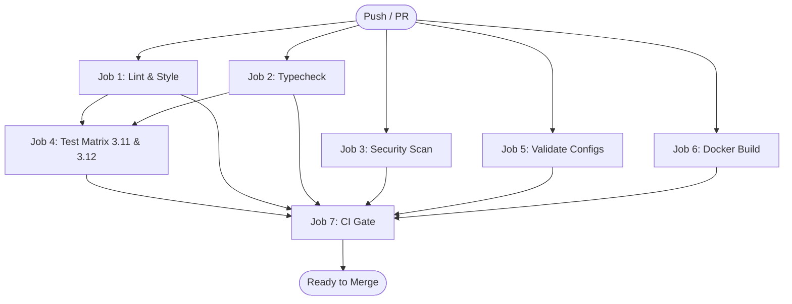

# Continuous Integration & Automation (CI/CD)

> Exhaustive documentation for GitHub Actions workflows, automated quality gates, security scans, container builds, and pre-commit hooks.

---

## 1. Architectural Philosophy

The Financial RAG pipeline enforces a strict quality gate on every commit. Every Pull Request and commit to `main` passes through an automated validation suite that verifies:

1. **Deterministic Syntax & Formatting** (zero style drift via Ruff)
2. **Strict Static Typing** (zero typing regressions via Mypy)
3. **Multi-Vector Security** (SAST vulnerability scanning + git secret detection)
4. **Hermetic Test Execution** (unit + integration suite against a live Qdrant container service across Python 3.11 and 3.12)
5. **Config & Schema Invariants** (validating all JSON, YAML, and TOML infrastructure specs)
6. **Container Build Verification** (multi-stage Docker build caching and image integrity)
7. **Single CI Gate** (atomic branch protection requirement)

---

## 2. CI Workflow Pipeline (`.github/workflows/ci.yml`)

The primary CI pipeline is triggered automatically on:
- `push` to `main`
- `pull_request` targeting `main`

### Concurrency Controls
```yaml
concurrency:
  group: ${{ github.workflow }}-${{ github.ref }}
  cancel-in-progress: true
```
Pushes to active branches automatically cancel in-flight workflow runs, preventing resource contention and ensuring worker slots are reserved for current commits.

---

### Job Breakdown



#### Job 1: `lint` (Ruff Linter & Formatter)
- **Runner**: `ubuntu-latest`
- **Commands**:
  - `poetry run ruff check . --output-format=github`
  - `poetry run ruff format --check .`
- **Enforces**: PEP 8 styling, import sorting (`isort`), flake8 rules, pycodestyle conventions, unused imports, and formatting consistency.

#### Job 2: `typecheck` (Mypy Static Typing)
- **Runner**: `ubuntu-latest`
- **Commands**:
  ```bash
  poetry run mypy \
    ingestion/ \
    query/ \
    retrieval/ \
    generation/ \
    evaluation/ \
    observability/ \
    api/ \
    config/ \
    knowledge_graph/ \
    --ignore-missing-imports \
    --disallow-untyped-defs \
    --no-strict-optional \
    --pretty
  ```
- **Configuration**: Restores `.mypy_cache` via GitHub Actions cache. Enforces explicit return types, typed function parameters, and strict typing across all 9 production packages.

#### Job 3: `security` (SAST & Vulnerability Auditing)
- **Runner**: `ubuntu-latest`
- **Security Tools**:
  1. **pip-audit**: Dependency vulnerability scanner checking environment packages against known CVE advisories:
     ```bash
     poetry run pip-audit
     ```
  2. **Bandit**: Static Application Security Testing (SAST) scanning Python code with SARIF reporting uploaded to GitHub Security tab:
     ```bash
     poetry run bandit -r . -c pyproject.toml -x tests/ --format sarif --output bandit-results.sarif
     ```

#### Job 4: `test` (Hermetic Multi-Version Matrix)
- **Matrix**: `python-version: ["3.11", "3.12"]`
- **Live Service Container**:
  Spins up a native Qdrant container alongside the test runner:
  ```yaml
  services:
    qdrant:
      image: qdrant/qdrant:v1.9.2
      ports:
        - 6333:6333
  ```
- **Readiness Check**: Host-side polling curl against `http://localhost:6333/healthz`.
- **Test Command**:
  ```bash
  poetry run pytest tests/ \
    -v \
    --tb=short \
    --durations=20 \
    -m "not integration" \
    --cov=ingestion \
    --cov=query \
    --cov=retrieval \
    --cov=generation \
    --cov=observability \
    --cov=knowledge_graph \
    --cov=evaluation \
    --cov=api \
    --cov=config \
    --cov-report=term-missing \
    --cov-report=xml:coverage.xml \
    --cov-fail-under=80
  ```
- **Enforcement**: Minimum 80% test coverage gate across all packages. Fails build if coverage falls below threshold.
- **Codecov**: Uploads `coverage.xml` on Python 3.11 run.

#### Job 5: `validate-configs` (Infrastructure Schema Validation)
- Validates syntax and configuration integrity for:
  - `pyproject.toml`
  - `docker-compose.yml` (`docker compose config --quiet`)
  - `prometheus.yml` (Prometheus scrape configuration)
  - Pre-commit hook configurations

#### Job 6: `docker-build` (Container Artifact Validation)
- Uses `docker/setup-buildx-action` and GitHub Actions Docker layer cache.
- Builds the production container:
  ```bash
  docker build --tag financial-rag-system:ci --target production .
  ```
- Verifies that image compiles without missing build dependencies, layer bloat, or invalid multi-stage instructions.

#### Job 7: `ci-gate` (Unified Branch Protection Barrier)
- Depends on all upstream jobs (`needs: [lint, typecheck, security, test, validate-configs, docker-build]`).
- Serves as the single required GitHub Status Check for branch protection rules, eliminating the need to reconfigure repository settings when adding or updating individual matrix jobs.

---

## 3. Local Development Gate: Pre-Commit Hooks

Developers can run the identical checks locally before staging commits.

### Installation
```bash
poetry run pre-commit install
```

### Manual Execution Across Repository
```bash
poetry run pre-commit run --all-files
```

### Hook Stack
| Hook | Tool | Target |
|:---|:---|:---|
| `ruff` | Ruff Linter | Automatic fixes for imports and code style |
| `ruff-format` | Ruff Formatter | Consistent whitespace, quotes, line wrapping |
| `mypy` | Mypy | Strict type checks against project stubs |
| `bandit` | Bandit | High-severity security issues |
| `trufflehog` | TruffleHog | Secret scanning for uncommitted secrets |

---

## 4. Failure Triage & Troubleshooting Guide

| Failure Mode | Diagnosis Step | Quick Fix Command |
|:---|:---|:---|
| **Lint / Format Failure** | Ruff identified unsorted imports or formatting issues | `poetry run ruff check . --fix && poetry run ruff format .` |
| **Mypy Type Error** | Missing type annotation or mismatched optional field | `poetry run mypy <file.py>` — annotate with `str \| None` or proper return type |
| **Bandit Security Flag** | Suspicious AST pattern (e.g. `assert` in production, insecure binding) | Add `# nosec <ID>` with explanatory comment if legitimate, or fix AST usage |
| **TruffleHog Secret Alert** | Unencrypted API key or fake secret token detected | Revoke key immediately, scrub commit via `git reset` or `git filter-repo` |
| **Coverage Under 80%** | New module or branch lacks adequate test coverage | Run `poetry run pytest tests/ --cov=<module> --cov-report=term-missing` and add tests |
| **Qdrant Connection Error in CI** | Test runner could not reach container service | Verify `QDRANT_URL=http://localhost:6333` is exported in test step |
