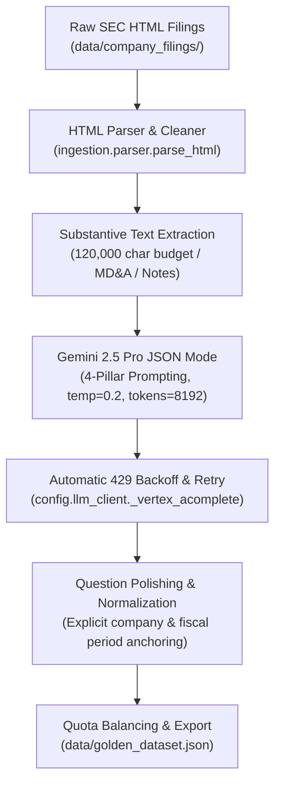

# Golden Evaluation Dataset Specification & Methodology

## Executive Summary

The **Golden Evaluation Dataset** ([`data/golden_dataset.json`](file:///home/deepak/rag-project/data/golden_dataset.json)) serves as the authoritative ground-truth benchmark for evaluating the Financial RAG pipeline. It was constructed using **Google Gemini 2.5 Pro** (`gemini-2.5-pro`) via Google Cloud Vertex AI REST and Application Default Credentials (ADC), grounded strictly and exclusively in **43 real SEC Form 10-K and 10-Q filings** located in [`data/company_filings/`](file:///home/deepak/rag-project/data/company_filings/).

The dataset consists of **129 high-value, self-contained Question & Answer pairs** (3 questions per filing across all 43 filings), spanning 4 portfolio companies (**Netflix**, **NVIDIA**, **UnitedHealth Group**, and **Walmart**) across fiscal years 2023 through 2026.

---

## 1. Architectural Principles & Industry Standards

In modern AI engineering and enterprise RAG benchmarking (as advocated by frameworks such as Ragas, ARES, TruLens, and DeepEval), synthetic evaluation datasets generated by frontier reasoning models represent the industry gold standard.

### Core Principles Applied:
1. **Model Asymmetry (Frontier Reasoner vs. Serving Model)**:
   - Benchmark generation uses **`gemini-2.5-pro`** (a frontier model with deep reasoning and 8,192 maximum output tokens) to formulate challenging, nuanced financial questions and comprehensive answers.
   - The production RAG pipeline serves answers using **`gemini-2.5-flash`**. This guarantees that the evaluation judge and benchmark are structurally more capable than the system under test.
2. **Strict Factual Grounding (Zero Hallucination)**:
   - The model is explicitly constrained to the provided SEC filing excerpt. It cannot synthesize facts, infer unstated trends, or draw from external knowledge.
   - Every ground truth answer must cite exact dollar amounts, percentages, units, fiscal quarters, and operational drivers reported in the filing.
3. **100% Question Self-Containment**:
   - Questions never rely on ambiguous deictic references (e.g., *"in the filing"*, *"in this quarter"*).
   - The post-processing engine automatically anchors the full legal company name and exact fiscal period into every question (e.g., *"In NVIDIA's fiscal year 2025 second quarter Form 10-Q..."*).
4. **Stratified Multi-Pillar Taxonomy**:
   - Questions reflect realistic queries asked by buy-side and sell-side equity research analysts, balanced across 4 distinct financial pillars.

---

## 2. The 4 Financial Evaluation Pillars

Every sample in the dataset adheres to one of four core financial pillars:

```
┌────────────────────────────────────────────────────────────────────────┐
│                        Financial Evaluation Pillars                    │
├────────────────────────┬───────────────────────────────────────────────┤
│ 1. Segment & Core      │ Specific segment revenues, regional ARPU/ARM, │
│    Financials (~30%)   │ operating margins, balance sheet items.       │
├────────────────────────┼───────────────────────────────────────────────┤
│ 2. MD&A & Strategic    │ Operational roadmaps, Blackwell GPU cadence,  │
│    Initiatives (~35%)  │ ad-tier rollouts, Optum care models.          │
├────────────────────────┼───────────────────────────────────────────────┤
│ 3. Risk Factors &      │ Export controls, Change Healthcare cyber      │
│    Disclosures (~25%)  │ incident, tariffs, inventory provisions.      │
├────────────────────────┼───────────────────────────────────────────────┤
│ 4. Capital Allocation  │ Share repurchase authorizations, free cash    │
│    & Cash Flow (~10%)  │ flow conversion, debt maturities, dividends.  │
└────────────────────────┴───────────────────────────────────────────────┘
```

---

## 3. Dataset Generation Workflow

The generation pipeline in [`scripts/generate_golden_dataset.py`](file:///home/deepak/rag-project/scripts/generate_golden_dataset.py) executes through 5 automated stages:



### Stage Details:
1. **Document Discovery & Fiscal Period Derivation**:
   - Discovers all downloaded `.htm` filings in `data/company_filings/`.
   - Uses [`CompanyRegistry.derive_fiscal_period()`](file:///home/deepak/rag-project/config/companies.py) to accurately calculate fiscal years and quarters based on each company's fiscal year end (e.g. NVDA and WMT end in January; NFLX and UNH end in December).
2. **Substantive Text Extraction (`extract_meaningful_text`)**:
   - Raw SEC `.htm` files are 15–30 MB each, with 80–90% consisting of inline CSS styles, XBRL tags, base64 images, and procedural boilerplates.
   - `parse_html()` extracts clean text sections.
   - `extract_meaningful_text()` scores sections against financial keywords and allocates **120,000 characters (~25,000–30,000 words / tokens)** per filing.
   - Prioritizes: **Item 7 / Item 2 (MD&A)**, **Item 1 (Business Segments)**, **Item 8 (Financial Statements)**, **Item 1A (Risk Factors)**, and **Notes to Consolidated Financial Statements**.
3. **Gemini 2.5 Pro Structured Generation**:
   - Invokes `gemini-2.5-pro` with Google Cloud ADC via direct HTTP REST.
   - Enforces valid JSON output conforming to `{ "samples": [ ... ] }`.
4. **Resilience & Rate-Limit Handling**:
   - `config/llm_client.py` includes built-in exponential backoff retries for HTTP 429 (Resource Exhausted) and HTTP 500/503 errors.
   - Concurrent workers are paced at 2 threads to respect Google Cloud Vertex AI rate limits.
5. **Polishing & Normalization (`polish_qa_sample`)**:
   - Replaces vague phrases like *"in this filing"* with *"in [Company]'s [Period] SEC filing"*.
   - Removes repetitive boilerplate prefixes from ground truth answers.

---

## 4. Dataset Distribution & Breakdown

### Summary by Company

| Company | Ticker | Downloaded Filings | Questions Generated | Period Range |
| :--- | :---: | :---: | :---: | :---: |
| **Netflix** | `NFLX` | **11 filings** (3 × 10-K, 8 × 10-Q) | **33 questions** | FY 2023 – Q2 2026 |
| **NVIDIA** | `NVDA` | **11 filings** (3 × 10-K, 8 × 10-Q) | **33 questions** | FY 2024 – Q2 2026 |
| **UnitedHealth Group** | `UNH` | **10 filings** (2 × 10-K, 8 × 10-Q) | **30 questions** | FY 2023 – Q2 2026 |
| **Walmart** | `WMT` | **11 filings** (3 × 10-K, 8 × 10-Q) | **33 questions** | FY 2024 – Q2 2026 |
| **Total Benchmark** | — | **43 filings** | **129 questions** | **Full 2024–2026 Scope** |

### Breakdown by Filing Type
- **Annual Reports (Form 10-K)**: **33 questions** across 11 annual filings.
- **Quarterly Reports (Form 10-Q)**: **96 questions** across 32 quarterly filings:
  - Q1: 36 questions (12 filings)
  - Q2: 36 questions (12 filings)
  - Q3: 24 questions (8 filings)

### Breakdown by Fiscal Year
- **FY 2023**: 6 questions (historical baseline 10-Ks)
- **FY 2024**: 27 questions
- **FY 2025**: 48 questions (peak operational comparison period)
- **FY 2026**: 36 questions
- **FY 2027**: 12 questions (NVDA / WMT offset fiscal calendar quarters)

---

## 5. Validation Results & Quality Metrics

Validation is automated via [`scripts/validate_golden_dataset.py`](file:///home/deepak/rag-project/scripts/validate_golden_dataset.py):

```bash
poetry run python -m scripts.validate_golden_dataset
```

### Validation Report Output:
```json
{
  "total_samples": 129,
  "valid_schema": true,
  "by_ticker": {
    "NFLX": 33,
    "NVDA": 33,
    "UNH": 30,
    "WMT": 33
  },
  "by_year": {
    "2023": 6,
    "2024": 27,
    "2025": 48,
    "2026": 36,
    "2027": 12
  },
  "by_period": {
    "Annual (10-K)": 33,
    "10-Q (Q1)": 36,
    "10-Q (Q2)": 36,
    "10-Q (Q3)": 24
  },
  "avg_question_length": 161.3,
  "avg_ground_truth_length": 645.9,
  "self_contained_ratio": 1.0
}
```

### Quality Assurance Criteria:
1. **Pydantic Schema Validation**: 100% of samples (129 / 129) instantiate as valid [`EvalSample`](file:///home/deepak/rag-project/evaluation/models.py) objects.
2. **Self-Containment**: 100% of questions explicitly specify the company name or ticker and fiscal period.
3. **Factual Density**: Ground-truth answers average **645.9 characters**, providing complete factual explanations rather than terse single-word answers.
4. **Unique Sample Identifiers**: Every sample has a deterministic, unique ID conforming to `{ticker}_{year}_{period}_{slug}`.

---

## 6. Representative Dataset Samples

### Example 1: NVIDIA (`NVDA` — FY 2026 Form 10-K)
```json
{
  "sample_id": "nvda_2026_annual_export_controls_china",
  "question": "According to NVIDIA's fiscal year 2026 10-K, what specific export control actions has the U.S. Government taken since August 2022 that have impacted sales to China, which products were affected, and what was China's regulatory response?",
  "ground_truth": "According to the filing, the U.S. Government has taken a series of actions impacting NVIDIA's sales to China. In August 2022, the USG announced export restrictions targeting China's semiconductor industry, specifically impacting NVIDIA's A100 and H100 integrated circuits. In October 2023, new licensing requirements were announced for exports to China and other country groups for products exceeding certain performance thresholds, including the A100, A800, H100, H800, L4, L40, L40S, RTX 4090, GB200 NVL72, and B200. In April 2025, the USG required a license for the export of H20 integrated circuits to China. In response, on September 15, 2025, China’s antitrust regulators published a preliminary finding that NVIDIA's compliance with U.S. export controls, which required offering degraded products, discriminated unfairly against customers in the China market and violated the terms of China’s approval of the Mellanox acquisition.",
  "ticker": "NVDA",
  "year": 2026,
  "quarter": null
}
```

### Example 2: Netflix (`NFLX` — FY 2025 Form 10-K)
```json
{
  "sample_id": "nflx_2025_annual_wbd_transaction_financing",
  "question": "According to its fiscal 2025 10-K, what financing commitments has Netflix obtained for its proposed transaction with Warner Bros. Discovery (WBD), and what is the potential termination fee if the deal fails under certain circumstances?",
  "ground_truth": "For its transaction to acquire WBD’s streaming and studios businesses, Netflix has obtained commitments for a senior unsecured bridge term loan facility of up to $42.2 billion, a $5 billion senior unsecured revolving credit facility, and a $20 billion senior unsecured delayed draw term loan facility. The filing also states that if the WBD transaction is not completed, it could result in Netflix's obligation to pay a $5.8 billion termination fee in certain specified circumstances.",
  "ticker": "NFLX",
  "year": 2025,
  "quarter": null
}
```

### Example 3: UnitedHealth Group (`UNH` — FY 2023 Form 10-K)
```json
{
  "sample_id": "unh_2023_annual_brazil_disposition",
  "question": "According to its fiscal year 2023 10-K, what strategic action did UnitedHealth Group take regarding its operations in Brazil, and what is the expected financial impact?",
  "ground_truth": "On December 22, 2023, UnitedHealth Group entered into an agreement to sell its operations in Brazil to a private investor. The disposition was completed on February 6, 2024, and the company expects to record a loss of approximately $7 billion in the quarter ended March 31, 2024. The majority of this loss is due to foreign currency translation losses that were in accumulated other comprehensive income.",
  "ticker": "UNH",
  "year": 2023,
  "quarter": null
}
```

### Example 4: Walmart (`WMT` — FY 2024 Form 10-K)
```json
{
  "sample_id": "wmt_2024_annual_us_segment_performance",
  "question": "What were the net sales for Walmart's U.S. segment in fiscal 2024, and how does this performance compare to the prior two fiscal years and its contribution to Walmart's consolidated net sales?",
  "ground_truth": "For fiscal 2024, the Walmart U.S. segment, which is the company's largest, had net sales of $441.8 billion. This represented 69% of the company's consolidated net sales for the year. This is an increase from fiscal 2023, when its net sales were $420.6 billion, and fiscal 2022, when they were $393.2 billion. Historically, the Walmart U.S. segment has had the highest gross profit as a percentage of net sales and has contributed the greatest amount to the company's net sales and operating income.",
  "ticker": "WMT",
  "year": 2024,
  "quarter": null
}
```

---

## 7. Operational Usage & Maintenance

### Loading the Dataset in Code
The dataset is loaded through [`evaluation.dataset`](file:///home/deepak/rag-project/evaluation/dataset.py):

```python
from evaluation.dataset import load_golden_dataset, get_dataset_by_ticker

# Load all 129 samples
samples = load_golden_dataset()

# Filter by company ticker
nvda_samples = get_dataset_by_ticker("NVDA")  # 33 samples
```

### Regenerating or Extending the Dataset
To regenerate the dataset or process newly downloaded filings:

```bash
# Full generation using Gemini 2.5 Pro (default: 2 workers, ADC auth)
poetry run python -m scripts.generate_golden_dataset

# Test on 2 filings with custom output path
poetry run python -m scripts.generate_golden_dataset --max-files 2 --out data/test_dataset.json

# Validate newly generated dataset
poetry run python -m scripts.validate_golden_dataset
```
